# Instacook


For my Milestone 3 project I have created a personalised Cookbook web application, where the user can log into their account, search for recipes and add them to their own virtual cookbook. They can also add their own recipes into their cookbook, as well as edit and delete when required. They can also give star ratings to their recipes to help them highlight their favourites and make them easier to find in the future.


[Link to Instacook live site](https://instacook-64f0d9d64709.herokuapp.com/)

## Table of Contents

1. [User Experience (UX)](#user-experience-(UX))
2. [Features](#features)
3. [Testing](#testing)
4. [Deployment](#deployment)
5. [Technologies Used](#technologies-used)
6. [Code](#code)
7. [Credits](#credits)

# User Experience (UX) #

## User Stories

### First Time Visitor Goals
A first time visitor will need to:
* Quickly understand the purpose and content of the site.
* Clearly see where to navigate to register and start using the app straight away.
* Easily create new cookbooks and recipes once logged in from intuitive user experience design.
* Be able to contact the developer should they have any questions.
* Be able to view recipes straight away to gain inspiration.

### Returning and Frequent Visitor Goals
A returning visitor will need to:
* Be able to log in easily into existing account.
* View, edit and delete cookbooks that were made in a previous session.
* View, edit and delete recipes that were made in a previous session.

## Site Purpose

This web app has been designed to allow users a way to digitally store, manipulate and categorize their favourite recipes, as well as view other users' recipes for inspiration.

### Target Audience

The web app is aimed at people who enjoy exploring food and recipes, who want to store their favourite recipes somewhere they can easily access and update their own content.


### Site Objectives

* To allow users to create their own profile.
* Create cookbooks to organise different recipe content however the user sees fit.
* Create recipes to then store in digital cookbooks.
* View saved recipes and cookbook collections.
* Search through site-wide recipes submitted by all users.
* Allow the user access to edit and delete functionality for their own recipes and cookbooks. 
* Give the user a positive emotion experience with bright colours and imagery.
* Build responsive web app that can be used effectively on a mobile, tablet and laptop.
* Easy to navigate around and find key information.
* Provide the users with a way of contacting me and submitting a message to my email inbox
* A good UI site flow.
* To be accessible for screen readers.

### Approach

* The content of the site will be family-friendly and accessible to all.
* Before developing, I have planned out the UX flow using a flow chart (please see below) to ensure that the design of the site is intuitive for all user stories documented above.
* I wanted to make evertything accessible to the user, keeping click rate as low as possible without making the pages too busy and difficult to read, or take too long to load. 

### Wireframes

I used Figma and Balsamiq to plan and design my wireframes and user journey. I like using Figma in particular because it always you to brainstorm and keep all ideas and inspiration in one place as a singular visual to refer back to, which has been very useful throughout the project. I designed my web app in mobile format initially, before moving onto bigger screens, to ensure responsiveness was considered from the beginning, especially since most users will predominantly use their phones to access this app.

#### Mobile Design Wireframe

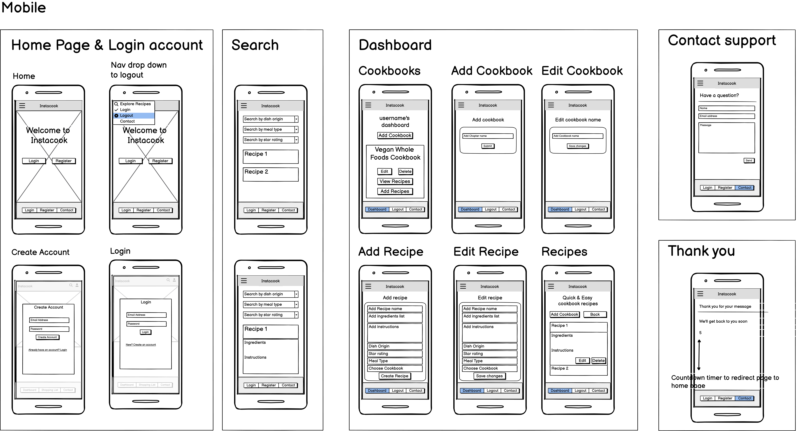

#### Tablet Design Wireframe


#### Desktop Design Wireframe


[Link to my Figma page](https://www.figma.com/file/a16YGDltwNMRzhCTNCDAV1/Milestone-3---Instacook?type=design&node-id=0%3A1&mode=design&t=vR4mpWydSqybmKji-1)

### User Journey
I created UX flow charts using FigJam to map out the user stories.


New visitor

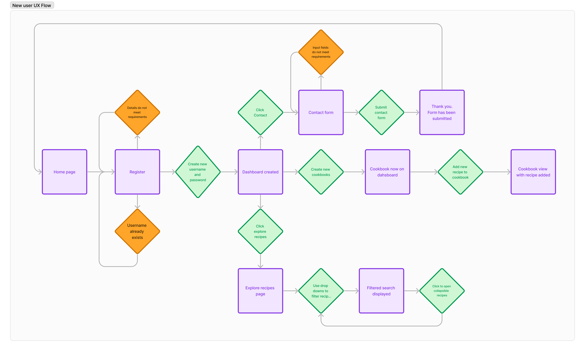

Returning and frequent visitor

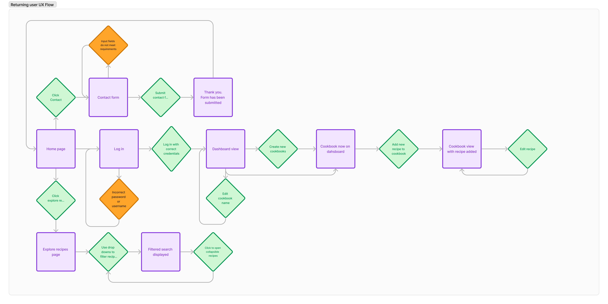

### Database Schema
Here is a database schema flow chart I created using Miro.

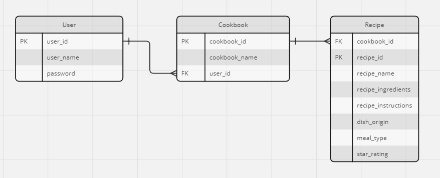


### Colour Scheme

I used Coolor to choose a fresh, vibrant colour palette for the site. Once chosen, I then checked colour combinations of the palette through the contrast checker to make sure the readability of my site was at a high standard and that I was followed good practices for accessibility.

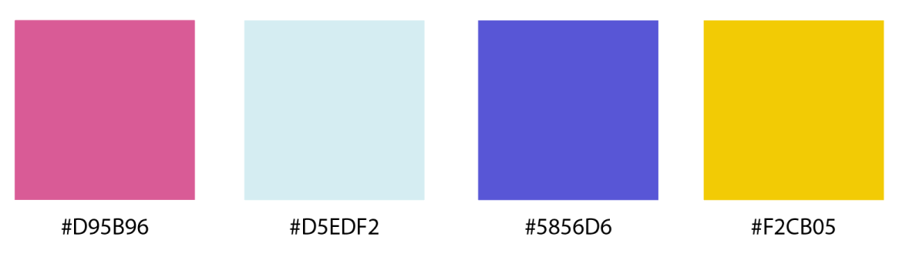

I checked the contrast combinations I would use, all with good readability except for yellow on white:
Purple
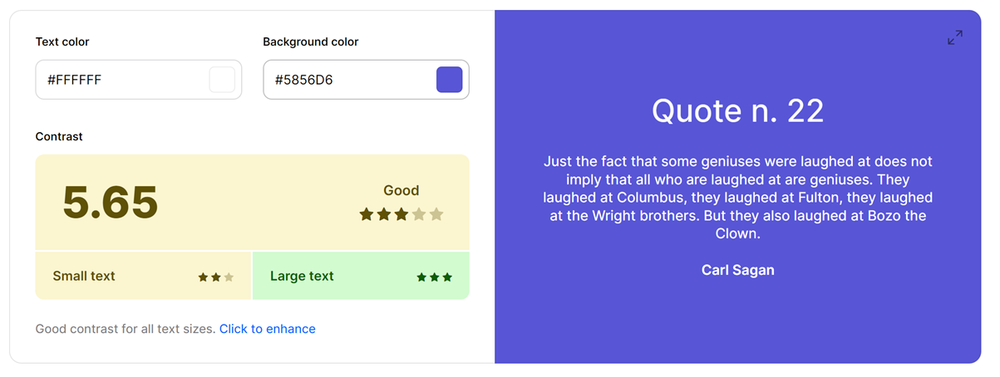
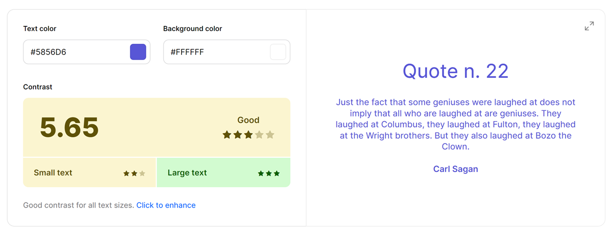
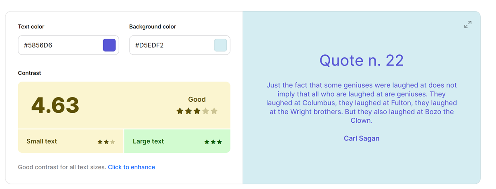
Pink
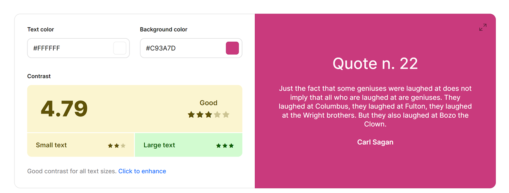
Yellow
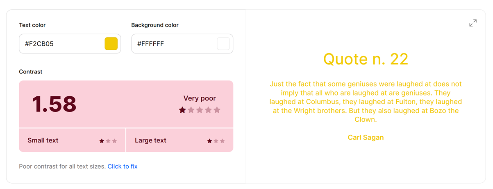
With the contrast not being acceptable between yellow and white, I have made sure I do not put yellow text on white  anywhere on the site.

### Typography

I chose a cursive font for titles, 'Pacifico' and 'Poppins' a simple sans-serif for the body text that is easy to read. I wanted to ensure I maintained good readability, which in turn will give an overall better user experience.

### Imagery

* I created the logo myself using the main title font 'Pacifico' and designing the logo in Adobe Illustrator.


# Features #

## Existing Features

### General

* My site is fully responsive and can be viewed and used effectively on all screen sizes down to 320px width by 480px height.
* I have considered readability contrast carefully for all visual elements.
* I have included a Favicon page tab icon to make the page look professional and consistent.

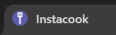

### Logo
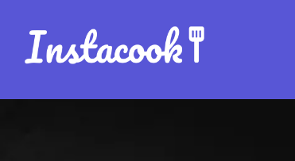

* I created my simple text logo using the Pacifico font to keep a design consistency within the site.

## Landing page

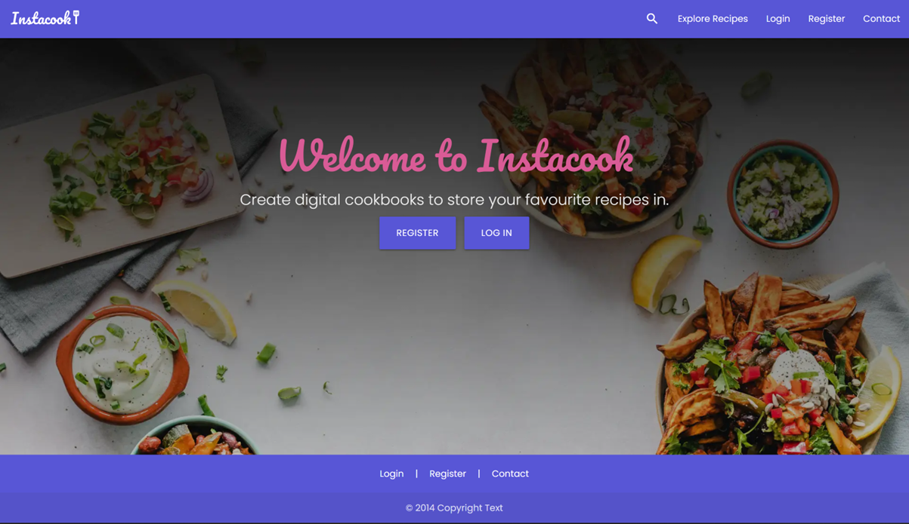

* To keep things clear I have sectioned out the page, so that the ingredients are on the left and the coffee drink is on the right to be created and filled up by the user. In mobile and tablet, the cup appears at the top with the ingredients at the bottom so the user instinctively reads the drink name first, sees the cup to fill and then proceeds to the ingredients to make choices.

### Register page

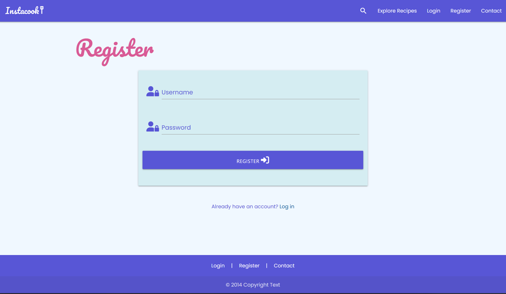

* I c

### Login page

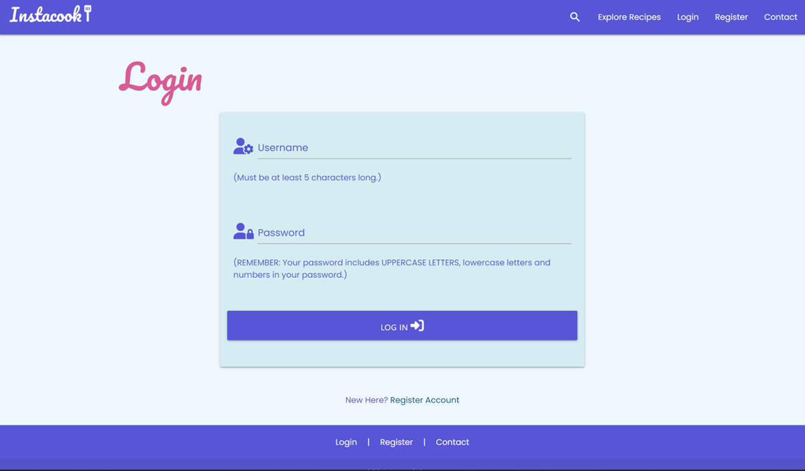

### Explore recipes page

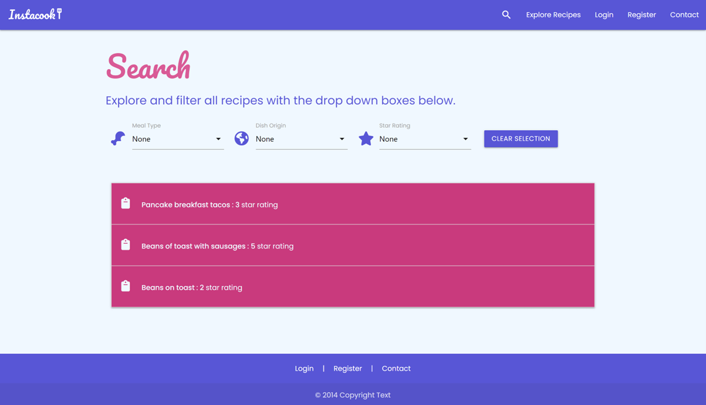

### Contact Form

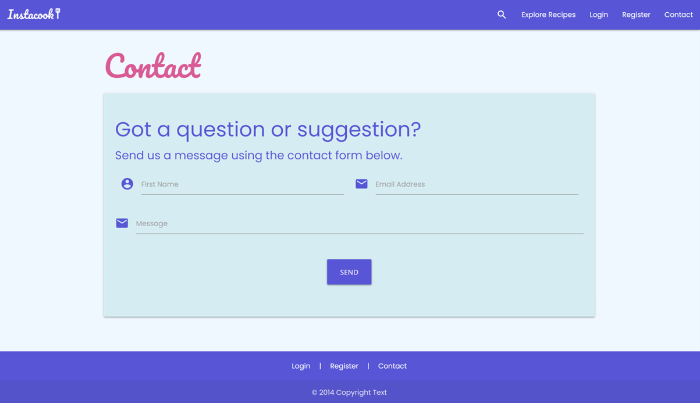

* All inputs are required
* The contact form checks the input is valid before sending and if not it will alert the user - the email input will not work unless a proper email address is added, and you cannot leave any field blank.

## Thank you page

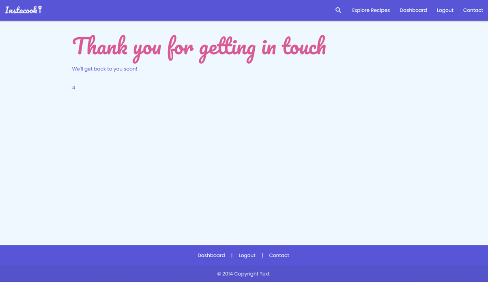

* A quick message to the user to confirm their message has been submitted and to redirect them back to the app page within 5 seconds.

## Error 404 page

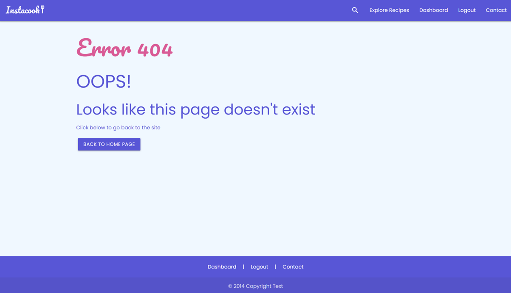

* Should any errors occur, the user will be directed to this page. I have included this page in the sendmail js file function, should the form not successfully submit. The page has a button that links back to the app page, so the user can return back to the main site easily and quickly.

## Possible Future Features

* 

## Accessibility

# Deployment

I used Heroku to deploy my site, coupled with ElephantSQL to host my relational database for free.

## ElephantSQL

1. From the [ElephantSQL](https://www.elephantsql.com/) homepage, you need to sign up for an account or log in.

2. Once logged in, you will be directed to the Instances page for your log in. You need to click on 'Create a new instance' in the top right hand corner.

3. Name your database, choose the 'Tiny Turtle' free plan, select the closest region to your location and then click the 'Create Instance' button and the bottom right corner of the page.

4. Then you will be able to see your new instance listed on your instances page. Click on your database name.

5. Within the database details, you will see a URL section -  copy the URL link and save for later during the Heroku deployment.

6. Finally, make sure in the '__init__.py' that you ad the if statement code snippet below. This ensures that SQLAlchemy can still read the external database.


## Heroku

1. Before navigating to the Heroku site to deploy, you need to make sure you have an up-to-date requirements.txt file and Procfile created in your repository. These will make sure Heroku knows all the required applications and their correct versions to deploy and function properly.

2. To create the requirements.txt file, use the following command in your terminal:

    "pip3 freeze --local > requirements.txt"

3. Similarly for the Procfile, use the following command in your terminal (make sure Procfile is capitalised. It does not need a file extension. The example below assumes the python file to launch your app is called 'run.py', so please change out if required):

    "echo web: python run.py > Procfile"

4. Check both files have been created properly. A couple of potential issues to be made a aware of:
- Make sure Procfile has the Heroku logo next to it in the file explorer view in your IDE
- Check that there are no blank lines at the end of the Procfile and delete them if found, as this can prevent it from deploying when being read by Heroku. Save, commit and push these files to your repository.

5. Login or register on the [Heroku](https://www.heroku.com) homepage.

6. Once on your dashboard, click the 'New' button and then 'Create new app' when it drops down.

7. Type in a unique app name, choose your region and click 'Create App'.

8. Now this has been created, we can now linke this to our repository in GitHub and our ElephantSQL database. Click on 'settings' heading in the app dashboard, then scroll down to click 'Reveal Config Vars'.

9. Add your config variables in this section for Heroku to build the app - these will be all the variables in your env.py file. It will look like this:

    | KEY | VALUE |
    | -- | -- |
    | DATABASE_URL | POSTGRES_DB_URL_FROM_ELEPHANT_SQL |
    | DEBUG | TRUE |
    | IP | 0.0.0.0 |
    | PORT | 5000 |
    | SECRET_KEY| YOUR_SECRET_KEY |

NOTES:
- The secret key value can be anything, but needs to be kept confidential.
- 'POSTGRES_DB_URL_FROM_ELEPHANT_SQL' - paste your ElephantSQL URL link in here.
- DEBUG set to TRUE is only for during the development phase, so make sure when deploying the finished app, to delete this variable.

10. You're now ready to click the enable automatic deploys and create button. Heroku will start building the app.

11. We will now need to go the more button on the dashboard and select run console. This is where we will set up the tables in the database we have created on ElephantSQL.

12. Type python3 and then once the python interpreter opens, we can run the following:

    from recipes import db
    db.create_all()
    exit()
    ```

13. Now that the relational database has been set up and the tables created, we can now click open app and the budgify application should now open in a new tab.

### Forking the GitHub Repository

By forking the GitHub Repository we make a copy of the original repository on our GitHub account to view and/or make changes without affecting the original repository by using the following steps...

1. Login to GitHub.
2. Locate the repository, you can use a link you have been provided with or use the search function in the top left of the screen.
3. In the top right hand corner of the page locate and click the 'fork' button.
4. Near the bottom of the page click the green button that says 'Create Fork'.
5. You should now have a copy of the original repository in your GitHub account.

### Making a Local Clone

1. Login to GitHub.
2. Locate the repository, you can use a link you have been provided with or use the search function in the top left of the screen.
3. Near the top of the repository click the green 'Code' button.
4. To clone the repository using HTTPS, under HTTPS copy the link provided.
5. Open the terminal in your code editor. 
6. Change the current working directory to the location where you want the cloned directory to be made.
7. Type git clone, and then paste the URL you copied in Step 3.
8. Press Enter. Your local clone should be created.

# Testing

I have documented my testing in a separate document [TESTING.md](TESTING.md)

# Media Queries

* I used Media Queries to debug and override some display issues that were not rectified with Bootstrap's responsive layouts.

# Technologies Used #

## Languages used
* HTML
* CSS
* Python
* Javascript

## Databases used
* PostgresSQL relational database

## Frameworks, Libraries & Programs Used
* [Am I Responsive](https://ui.dev/amiresponsive?url=https://instacook-64f0d9d64709.herokuapp.com) - To generate a screen mockup of my web app for this README.
* [Gitpod](https://gitpod.com) - To create, edit, preview and push my code to my Github repository.
* [Git](https://git-scm.com/) - For version control.
* [Github](github.com) - To store versions of my site's repository while developing and then for deployment.
* [Heroku](heroku.com) - I deployed my project through Heroku.
* [Adobe Illustrator](https://www.adobe.com/uk/products/illustrator.html) - For designing the logo and favicon.
* [Balsamiq](https://balsamiq.com/) - For wireframes.
* [Miro](https://miro.com/) - To create my database schema.
* [Figma ad FigJam](figma.com) - Used as a design board to lay out my wireframes and keep a copy of my design thought process all in one place. I also used it to creat UX flow charts while planning my web app.
* [Adobe Photoshop](https://www.adobe.com/uk/products/photoshop.html) - Used for exporting any site images as .webp files to reduce file size and in turn improve the performance of my site.
* [EmailJS](https://www.emailjs.com/) - Used with my functional contact form that sends user messages to my inbox.
* [ElephantSQL](https://www.elephantsql.com/index.html) - Hosted my PostgresSQL database online.
* [Coolors](https://coolors.co/contrast-checker/112a46-acc8e5) - Contrast checker to test readability.
* [Materialize](https://materializecss.com/) - I used this CSS library for certain components in my web app.
* [Flask](https://flask.palletsprojects.com/en/2.3.x/) - The micro framework I used for my project.
* [Font Awesome](https://fontawesome.com/) - For all the icons in my web app.
* Google Dev Tools - Used to troubleshoot issues both front-end and back-end. It also includes Lighthouse which I used for testing.
* [Google Fonts](https://fonts.google.com/) - To import the fonts I chose for the website.
* [Jinja](https://jinja.palletsprojects.com/en/3.1.x/) - Templating engine
* [html5pattern](html5pattern.com) - The the HTML 5 regex pattern to make sure users create a secure password.
* [JSHint](https://jshint.com/) - To validate javaScript code.
* [SQLAlchemy](https://www.sqlalchemy.org/) - Database toolkit library for Python.
* [W3C](https://validator.w3.org/) - To validate and test HTML and CSS code.
* [Favicon](https://favicon.io/) - Generated my favicon files from the favicon I designed.

# Code

* **Thank-you page** - I used this code snippet to get the Thank You page to re-direct back to the site after 5 seconds. This was from a [Stack Overflow thread.](https://stackoverflow.com/questions/3292038/redirect-website-after-specified-amount-of-time)


* **Favicon** - I used a [Favicon generator](https://favicon.io/) to create the appropriate files for me to upload to my site, as well as this code snippet to install it site-wide.


# Credits

* Code Institute relational database walkthrough helped me work out how to create and best approach creating this project.
* Google fonts for ['Silkscreen' typography.](https://fonts.google.com/specimen/Silkscreen) and ['Rubik' typography.](https://fonts.google.com/specimen/Rubik)
* Logo and favicon I designed myself.
* Images from [Pexels](pexels.com).


### Thanks

* Martina Terlevic my CI mentor, for her encouragement and advice.
* Liz Curtis my friend and fellow coder, for patiently listening, giving encouragement and brainstorming with me when I was troubleshooting.
* The big and little human beings of the Ulloa-James household who have been very patient with me, allowing me the time day or night to get my coding done.