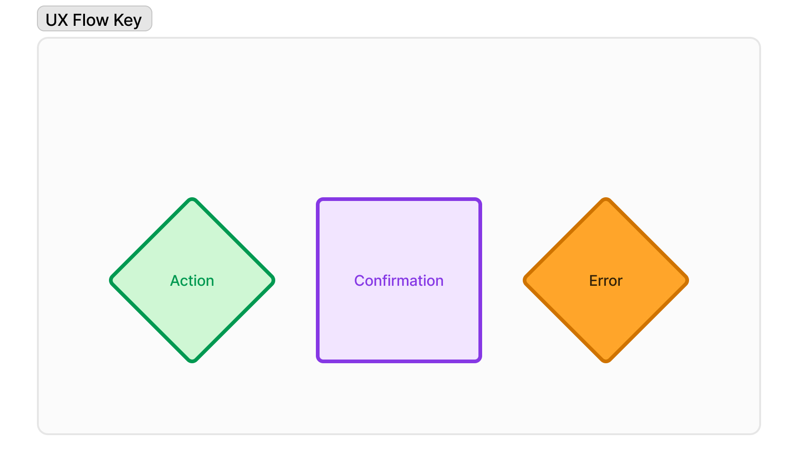
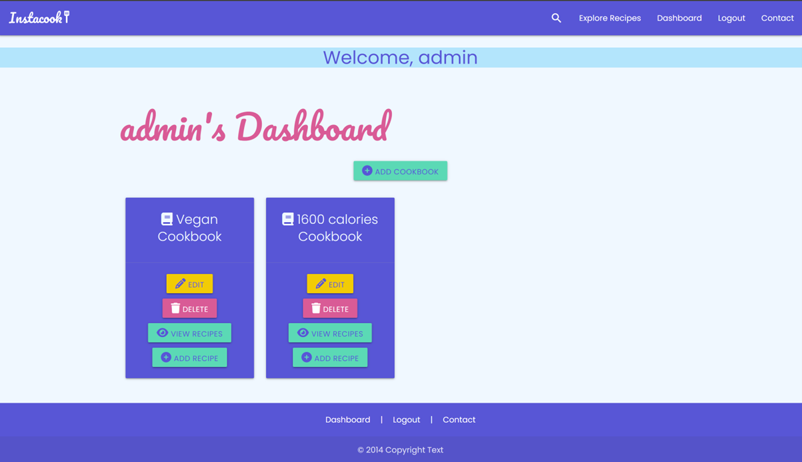
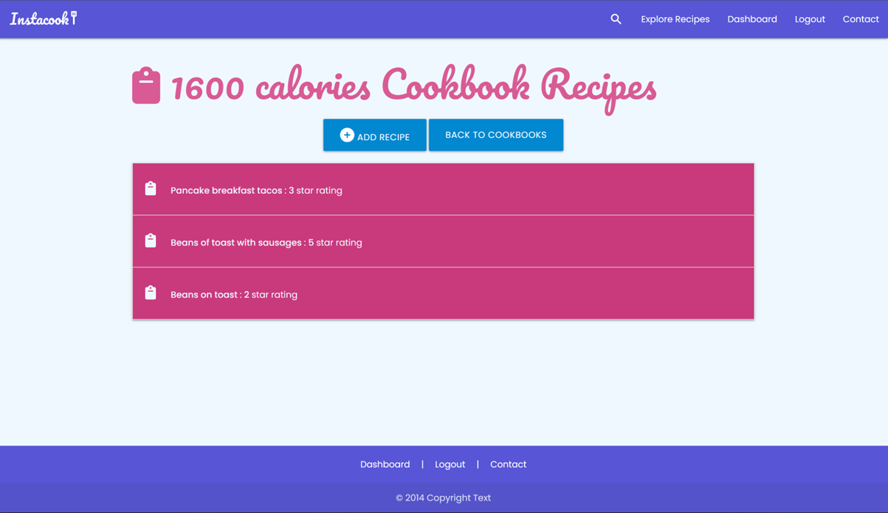
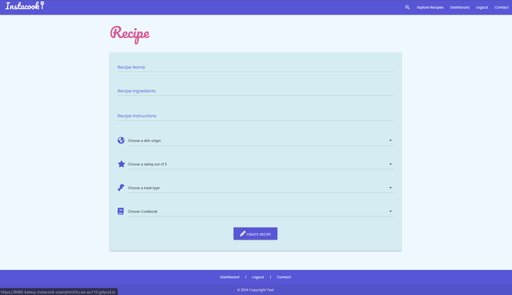
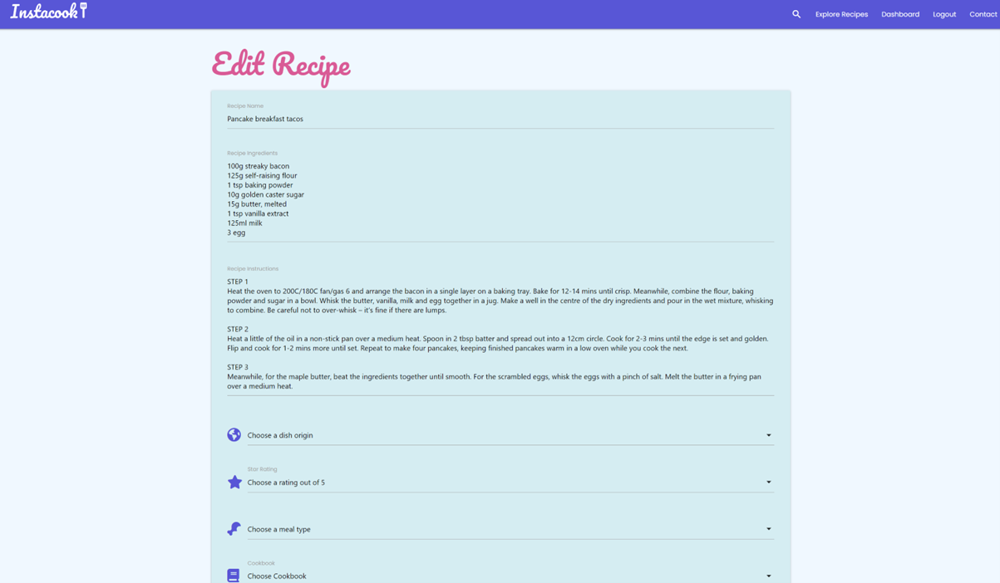
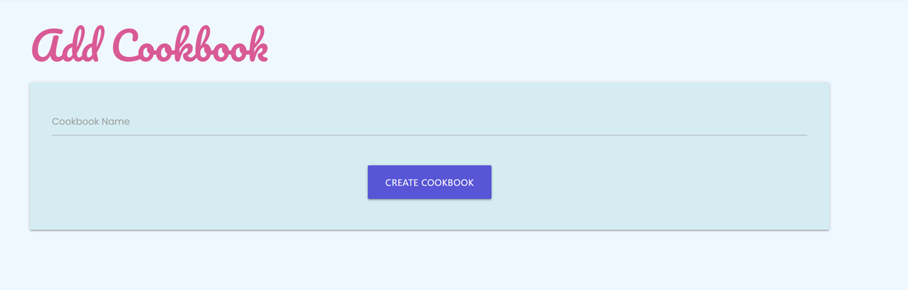
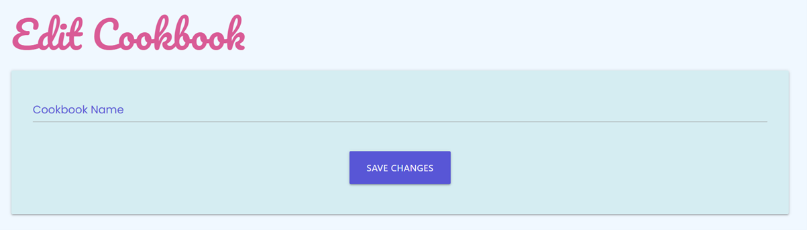

# Instacook

For my Milestone 3 project I have created a personalised Cookbook web application, where the user can log into their account, search for recipes and add them to their own virtual cookbook. They can also add their own recipes into their cookbook, as well as edit and delete when required. They can also give star ratings to their recipes to help them highlight their favourites and make them easier to find in the future.

[Link to Instacook live site](https://instacook-64f0d9d64709.herokuapp.com/)

## Table of Contents

1. [User Experience (UX)](#user-experience-(UX))
2. [Features](#features)
3. [Testing](#testing)
4. [Deployment](#deployment)
5. [Technologies Used](#technologies-used)
6. [Code](#code)
7. [Credits](#credits)

# User Experience (UX) #

## User Stories

### First Time Visitor Goals
A first time visitor will need to:
* Quickly understand the purpose and content of the site.
* Clearly see where to navigate to register and start using the app straight away.
* Easily create new cookbooks and recipes once logged in from intuitive user experience design.
* Be able to contact the developer should they have any questions.
* Be able to view recipes straight away to gain inspiration.

### Returning and Frequent Visitor Goals
A returning visitor will need to:
* Be able to log in easily into existing account.
* View, edit and delete cookbooks that were made in a previous session.
* View, edit and delete recipes that were made in a previous session.

## Site Purpose

This web app has been designed to allow users a way to digitally store, manipulate and categorize their favourite recipes, as well as view other users' recipes for inspiration.

### Target Audience

The web app is aimed at people who enjoy exploring food and recipes, who want to store their favourite recipes somewhere they can easily access and update their own content.

### Site Objectives

* To allow users to create their own profile.
* Create cookbooks to organise different recipe content however the user sees fit.
* Create recipes to then store in digital cookbooks.
* View saved recipes and cookbook collections.
* Search through site-wide recipes submitted by all users.
* Allow the user access to edit and delete functionality for their own recipes and cookbooks. 
* Give the user a positive emotion experience with bright colours and imagery.
* Build responsive web app that can be used effectively on a mobile, tablet and laptop.
* Easy to navigate around and find key information.
* Provide the users with a way of contacting me and submitting a message to my email inbox
* A good UI site flow.
* To be accessible for screen readers.

### Approach

* The content of the site will be family-friendly and accessible to all.
* Before developing, I have planned out the UX flow using a flow chart (please see below) to ensure that the design of the site is intuitive for all user stories documented above.
* I wanted to make evertything accessible to the user, keeping click rate as low as possible without making the pages too busy and difficult to read, or take too long to load. 

### Wireframes

I used Figma and Balsamiq to plan and design my wireframes and user journey. I like using Figma in particular because it always you to brainstorm and keep all ideas and inspiration in one place as a singular visual to refer back to, which has been very useful throughout the project. I designed my web app in mobile format initially, before moving onto bigger screens, to ensure responsiveness was considered from the beginning, especially since most users will predominantly use their phones to access this app.

#### Mobile Design Wireframe

#### Tablet Design Wireframe

#### Desktop Design Wireframe

[Link to my Figma page](https://www.figma.com/file/a16YGDltwNMRzhCTNCDAV1/Milestone-3---Instacook?type=design&node-id=0%3A1&mode=design&t=vR4mpWydSqybmKji-1)

### User Journey
I created UX flow charts using FigJam to map out the user stories.

New visitor

Returning and frequent visitor

### Database Schema
Here is a database schema flow chart I created using Miro.

### Colour Scheme

I used Coolor to choose a fresh, vibrant colour palette for the site. Once chosen, I then checked colour combinations of the palette through the contrast checker to make sure the readability of my site was at a high standard and that I was followed good practices for accessibility.

I checked the contrast combinations I would use, all with good readability except for yellow on white:
Purple

Pink

Yellow

With the contrast not being acceptable between yellow and white, I have made sure I do not put yellow text on white  anywhere on the site.

### Typography

I chose a cursive font for titles, 'Pacifico' and 'Poppins' a simple sans-serif for the body text that is easy to read. I wanted to ensure I maintained good readability, which in turn will give an overall better user experience.

### Imagery

* I created the logo myself using the main title font 'Pacifico' and designing the logo in Adobe Illustrator.

# Features #

## Existing Features

### General

* My site is fully responsive and can be viewed and used effectively on all screen sizes down to 320px width by 480px height.
* I have considered readability contrast carefully for all visual elements.
* __Favicon__ - I have included a Favicon page tab icon to make the page look professional and consistent.

* __Reponsive Nav Bar__ - The navigation bar at the top of all the pages reduces to an accordion menu on tablet and mobile view for ease for use for the user. The options displayed on the nav bar are also dependent on whether a user is logged in or not, for an optimum user experience where options, such as 'Register' are no longer visible for logged in users. This keeps the pages clean and easier to navigate. I have included a search icon as well as 'Explore Recipes' as some users respond more to icons rather than text and vice versa. This way both types of users will find it easy to navigate to the search recipes page in one click.

* __Footer__ - Just like the nav bar, the links displayed in the footer are also dependent on whether a user is logged in or not, for an optimum user experience where options, such as 'Register' are no longer visible for logged in users. This keeps the pages clean and easier to navigate.

* __Logo__ - I created my simple text logo using the Pacifico font to keep a design consistency within the site.

* __Flash Messages__ - At various actions, messages will flash at the top of the page just below the nav bar to confirm to the user for instance, that a user account has been created, or a cookbook has been deleted. This gives the user a clear explanation of what has happened to avoid any unnecessary confusion.

## Landing page

* __Hero image slider__ - I wanted to include something visually impactful to the home page to the user a positive emotional response when they land. It also draws the eye of the user to the main call to actions - 'Log in' or 'Register', so both new users and returning users can navigate quickly to get started using the app features. There a 3 large images that the slider flips through, to also suggest to the user they can go straight into exploring existing recipes on the search page.

### Register page

* __Registration form__ - This form submits a new username and password to the database and starts a session cookie, which triggers the user dashboard to be active and display the user's cookbooks / give them the option to create cookbooks to start collating recipes into.

* __Password pattern required__ -  To make sure the user is creating strong passwords to keep their account secure, I have included an HTML5 regex pattern, so that the registration form will not submit unless the user has conformed to the requirements.

* __Requirement descriptions__ -  So it is clear what patterns are required for passwords and usernames, I have included explanations under each input field.

### Login page

* __Login form__ - This form starts a session cookie, which triggers the user dashboard to be active and display the user's cookbooks / give them the option to create cookbooks to start collating recipes into.

* __Requirement descriptions__ -  So it is clear what patterns are required for passwords and usernames, I have included explanations under each input field.

### Explore recipes page

* __Dropdown filters__ - I have included 3 dropdown filters for meal type, dish origin and star rating to give the user a few options of how they would like the filter and search through all the recipes on the database.

* __Clear selection button__ - This button allows to quicky refresh all the filters in one simple click when desired.

* __Collapsible recipe view__ - The collapsible recipe view allows more recipe titles to list on the screen at any given time, whilst also providing the user the ability to drill down into their chosen recipe content with one click.

### User dashboard page

* __Cookbook cards__ - For each cookbook linked to the user's id, a card will appear on their dashboard so they can see them all in one place and add/edit recipes for each of them.

* __Add cookbook button__ - To create new cookbooks, the 'Add Cookbook' button is at the top of the page for a concise user journey.

* __View recipes button__ - On each cookbook card, there is a 'View Recipes' button which will take the user to a page that is populated with the recipes that are linked to that particular cookbook id.

* __Add recipe button__ - On each cookbook card, there is an 'Add Recipes' button for users to be redirected to the 'Create recipe' form.

* __Edit and delete Cookbook buttons__ - These buttons give the user the option to update the cookbook name or delete it and all of the recipes linked with it. With the delete button, a modal pops up to explain to the user that the action cannot be undone and that the recipes linked to it will be deleted too, so they fully understand the action before choosing to commit.

### User recipes page

* __Add recipes button__ - To create new recipes, the 'Add Recipe' button is at the top of the page for a concise user journey.
* __Back to cookbook button__ - The user can also return to their dashboard cookbook overview with one click with the 'back to cookbooks' button, which is also at the top of the page so it is easily located by the user.

* __Collapsible recipe view__ - The collapsible recipe view allows more recipe titles to list on the screen at any given time, whilst also providing the user the ability to drill down into their chosen recipe content with one click.

* __Edit and delete recipe buttons__ - The edit and delete buttons are nested within each collapsible recipe, just below the instructions and ingredients content. These buttons allow the user to edit/delete that specific recipe. With the delete button, a modal pops up to explain to the user that the action cannot be undone, so they fully understand the action before choosing to commit.

### Add recipe form

* __Drop down options__ - To create a simple choice for the user, I included drop downs for certain inputs within the recipe forms, to allow the user to populate it as quickly as possible.

* __Add recipe form__ - Once submitted, this form adds a new recipe to the database linked the cookbook id that was selected in the drop down.

### Edit recipe form

* __Pre-populated edit recipe__ - When the user is directed to the edit recipe page, the input fields are already populated with the previous content, to make editing and updating easy and quick for the user.

* __Drop down options__ - To create a simple choice for the user, I included drop downs for certain inputs within the recipe forms, to allow the user to populate it as quickly as possible.

* __Edit recipe form__ - Once submitted, this form updates the current recipe on the database linked the cookbook id that was selected in the drop down.

### Edit recipe form

* __Cookbook name form__ - This form 

* __Edit cookbook name form__ - 

### Contact Form

* I have included a functional contact form created using emailjs for users to contact me.
* When a form is submitted, I receive an email with the user's message, name and email address included so I can respond to their query.
* All inputs are required.
* The contact form checks the input is valid before sending and if not it will alert the user - the email input will not work unless a proper email address is added, and you cannot leave any field blank.

## Thank you page

* A quick message to the user to confirm their message has been submitted and to redirect them back to the app page within 5 seconds.

## Error 404 page

* Should any errors occur, the user will be directed to this page. I have included this page in the sendmail js file function, should the form not successfully submit. The page has a button that links back to the app page, so the user can return back to the main site easily and quickly.

## Possible Future Features

* __Recipe API__ - In future I would like to implement a recipe api, to give the user the opportunity to search through a much larger database of recipes, and give them the oppourtunity to add copies of recipes to their own digital cookbooks.
* __Shopping List__ - To provide the user with the ability to add items to their own digital shopping list.
* __Search Bar__ - To implement word search functionality so the user could search recipes using text rather than dropdowns. 

## Accessibility

## Media Queries

* I used Media Queries to debug and override some display issues that were not rectified with Materialize's responsive layouts.

# Deployment #

I used Heroku to deploy my site, coupled with ElephantSQL to host my relational database for free.

## ElephantSQL

1. From the [ElephantSQL](https://www.elephantsql.com/) homepage, you need to sign up for an account or log in.

2. Once logged in, you will be directed to the Instances page for your log in. You need to click on 'Create a new instance' in the top right hand corner.

3. Name your database, choose the 'Tiny Turtle' free plan, select the closest region to your location and then click the 'Create Instance' button and the bottom right corner of the page.

4. Then you will be able to see your new instance listed on your instances page. Click on your database name.

5. Within the database details, you will see a URL section -  copy the URL link and save for later during the Heroku deployment.

6. Finally, make sure in the '__init__.py' that you ad the if statement code snippet below. This ensures that SQLAlchemy can still read the external database.

## Heroku

1. Before navigating to the Heroku site to deploy, you need to make sure you have an up-to-date requirements.txt file and Procfile created in your repository. These will make sure Heroku knows all the required applications and their correct versions to deploy and function properly.

2. To create the requirements.txt file, use the following command in your terminal:

    "pip3 freeze --local > requirements.txt"

3. Similarly for the Procfile, use the following command in your terminal (make sure Procfile is capitalised. It does not need a file extension. The example below assumes the python file to launch your app is called 'run.py', so please change out if required):

    "echo web: python run.py > Procfile"

4. Check both files have been created properly. A couple of potential issues to be made a aware of:
* Make sure Procfile has the Heroku logo next to it in the file explorer view in your IDE
* Check that there are no blank lines at the end of the Procfile and delete them if found, as this can prevent it from deploying when being read by Heroku. Save, commit and push these files to your repository.

5. Login or register on the [Heroku](https://www.heroku.com) homepage.

6. Once on your dashboard, click the 'New' button and then 'Create new app' when it drops down.

7. Type in a unique app name, choose your region and click 'Create App'.

8. Now this has been created, we can now linke this to our repository in GitHub and our ElephantSQL database. Click on 'settings' heading in the app dashboard, then scroll down to click 'Reveal Config Vars'.

9. Add your config variables in this section for Heroku to build the app - these will be all the variables in your env.py file. It will look like this:

    | KEY | VALUE |
    | -- | -- |
    | DATABASE_URL | POSTGRES_DB_URL_FROM_ELEPHANT_SQL |
    | DEBUG | TRUE |
    | IP | 0.0.0.0 |
    | PORT | 5000 |
    | SECRET_KEY| YOUR_SECRET_KEY |

NOTES:
- The secret key value can be anything, but needs to be kept confidential.
- 'POSTGRES_DB_URL_FROM_ELEPHANT_SQL' - paste your ElephantSQL URL link in here.
- DEBUG set to TRUE is only for during the development phase, so make sure when deploying the finished app, to delete this variable.

10. Now the config variables are set up, go to the 'Deploy' heading. The quickest, easiest way to deploy is through selecting the 'Connect to GitHub' deployment method. Go through the login GitHub authentication steps.

11. Once your GitHub account is connected, select the respository you want to run in the 'Connect to GitHub' section.

12. For easier updating if you make changes to your repository, enable automatic deployment from GitHub.

13. Now you are ready to click the 'Deploy' button from the main branch. Heroku will now build your app.

14. Finally, we need to click on the 'More' button at the top of the dashboard screen and select 'Run Console' from the dropdown. This will set up the models in the ElephantSQL database. This is where we will set up the tables in the database we have created on ElephantSQL.

12. When the terminal loads, type the following, hitting enter at the end of each line:

    python3

    from recipes import db

    db.create_all()

    exit()

13. This has now created the relational database models from your repository into the ElephantSQL database. When you click on 'Open App' on the dashboard, it should now open Instacook.

### Forking the GitHub Repository

Forking allows users to make a copy of an original repository in GitHub and view and make changes to it without changing the original repository. To create a fork:
1. Once logged into GitHub, follow the link to your chosen GitHub repository, or use the search bar to find it on the GitHub home page.
2. Once in the repository window, click the 'Fork' drop down arrow button in the top right-hand corner.
3. Select 'Create new fork'.
4. Check the details in the window before clicking the green 'Create Fork' button.
5. You will now be able to find the copy of the repository in your own GitHub account.

### Making a Local Clone

1. Once logged into GitHub, follow the link to your chosen GitHub repository, or use the search bar to find it on the GitHub home page.
2. Once in the repository window, click the green 'Code' button.
3. To clone the repository using HTTPS, copy the link provided below the HTTPS header.
4. Open a terminal in your code editor.
5. Change the location in the current working directory to where you want the cloned directory to be created.
6. Type "git clone" into the terminal, and then paste the URL you copied and click enter.
7. This should have created a local clone of the repository.
8. Here is the live link to my website - https://instacook-64f0d9d64709.herokuapp.com/

# Testing #

I have documented my testing in a separate document [TESTING.md](TESTING.md)

# Technologies Used #

## Languages used
* HTML
* CSS
* Python
* Javascript

## Databases used
* PostgresSQL relational database

## Frameworks, Libraries & Programs Used
* [Am I Responsive](https://ui.dev/amiresponsive?url=https://instacook-64f0d9d64709.herokuapp.com) - To generate a screen mockup of my web app for this README.
* [Gitpod](https://gitpod.com) - To create, edit, preview and push my code to my GitHub repository.
* [Git](https://git-scm.com/) - For version control.
* [GitHub](Github.com) - To store versions of my site's repository while developing and then for deployment.
* [Heroku](heroku.com) - I deployed my project through Heroku.
* [Adobe Illustrator](https://www.adobe.com/uk/products/illustrator.html) - For designing the logo and favicon.
* [Balsamiq](https://balsamiq.com/) - For wireframes.
* [Miro](https://miro.com/) - To create my database schema.
* [Figma ad FigJam](figma.com) - Used as a design board to lay out my wireframes and keep a copy of my design thought process all in one place. I also used it to creat UX flow charts while planning my web app.
* [Adobe Photoshop](https://www.adobe.com/uk/products/photoshop.html) - Used for exporting any site images as .webp files to reduce file size and in turn improve the performance of my site.
* [EmailJS](https://www.emailjs.com/) - Used with my functional contact form that sends user messages to my inbox.
* [ElephantSQL](https://www.elephantsql.com/index.html) - Hosted my PostgresSQL database online.
* [Coolors](https://coolors.co/contrast-checker/112a46-acc8e5) - Contrast checker to test readability.
* [Materialize](https://materializecss.com/) - I used this CSS library for certain components in my web app.
* [Flask](https://flask.palletsprojects.com/en/2.3.x/) - The micro framework I used for my project.
* [Font Awesome](https://fontawesome.com/) - For all the icons in my web app.
* Google Dev Tools - Used to troubleshoot issues both front-end and back-end. It also includes Lighthouse which I used for testing.
* [Google Fonts](https://fonts.google.com/) - To import the fonts I chose for the website.
* [Jinja](https://jinja.palletsprojects.com/en/3.1.x/) - Templating engine
* [html5pattern](html5pattern.com) - The the HTML 5 regex pattern to make sure users create a secure password.
* [JSHint](https://jshint.com/) - To validate javaScript code.
* [SQLAlchemy](https://www.sqlalchemy.org/) - Database toolkit library for Python.
* [W3C](https://validator.w3.org/) - To validate and test HTML and CSS code.
* [Favicon](https://favicon.io/) - Generated my favicon files from the favicon I designed.

# Code

* **Thank-you page** - I used this code snippet to get the Thank You page to re-direct back to the site after 5 seconds. This was from a [Stack Overflow thread.](https://stackoverflow.com/questions/3292038/redirect-website-after-specified-amount-of-time)

* **Favicon** - I used a [Favicon generator](https://favicon.io/) to create the appropriate files for me to upload to my site, as well as this code snippet to install it site-wide.

# Credits

* Code Institute relational database walkthrough helped me work out how to create and best approach creating this project.
* Google fonts for ['Silkscreen' typography.](https://fonts.google.com/specimen/Silkscreen) and ['Rubik' typography.](https://fonts.google.com/specimen/Rubik)
* Logo and favicon I designed myself.
* Images in the hero slider are from [Pexels](pexels.com):
    * https://www.pexels.com/photo/steak-food-769289/
    * https://www.pexels.com/photo/vegetable-salad-3026808/
    * https://www.pexels.com/photo/ice-cream-on-bowl-beside-spoon-1343504/
    * https://www.pexels.com/photo/assorted-salads-on-bowls-1640773/

### Thanks

* Martina Terlevic my CI mentor, for her encouragement and advice.
* Liz Curtis my friend and fellow coder, for patiently listening, giving encouragement and brainstorming with me when I was troubleshooting.
* The big and little human beings of the Ulloa-James household who have been very patient with me, allowing me the time day or night to get my coding done.