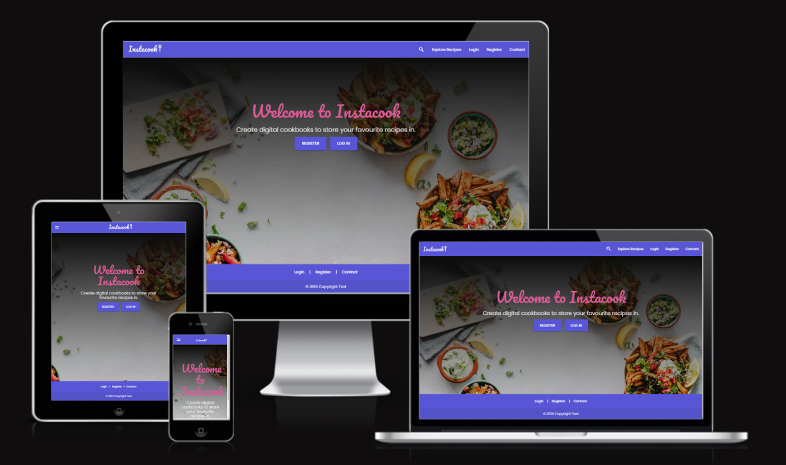

# Instacook

For my Milestone 3 project I have created a personalised Cookbook web application, where the user can log into their account, search for recipes and add them to their own virtual cookbook. They can also add their own recipes into their cookbook, as well as edit and delete when required. They can also give star ratings to their recipes to help them highlight their favourites and make them easier to find in the future.

[Link to Instacook live site](https://instacook-64f0d9d64709.herokuapp.com/)

## Table of Contents

1. [User Experience (UX)](#user-experience-(UX))
2. [Features](#features)
3. [Testing](#testing)
4. [Deployment](#deployment)
5. [Technologies Used](#technologies-used)
6. [Code](#code)
7. [Credits](#credits)

# User Experience (UX) #

## User Stories

### First Time Visitor Goals
A first time visitor will need to:
* Quickly understand the purpose and content of the site.
* Clearly see where to navigate to register and start using the app straight away.
* Easily create new cookbooks and recipes once logged in from intuitive user experience design.
* Be able to contact the developer should they have any questions.
* Be able to view recipes straight away to gain inspiration.

### Returning and Frequent Visitor Goals
A returning visitor will need to:
* Be able to log in easily into existing account.
* View, edit and delete cookbooks that were made in a previous session.
* View, edit and delete recipes that were made in a previous session.

## Site Purpose

This web app has been designed to allow users a way to digitally store, manipulate and categorize their favourite recipes, as well as view other users' recipes for inspiration.

### Target Audience

The web app is aimed at people who enjoy exploring food and recipes, who want to store their favourite recipes somewhere they can easily access and update their own content.

### Site Objectives

* To allow users to create their own profile.
* Create cookbooks to organise different recipe content however the user sees fit.
* Create recipes to then store in digital cookbooks.
* View saved recipes and cookbook collections.
* Search through site-wide recipes submitted by all users.
* Allow the user access to edit and delete functionality for their own recipes and cookbooks. 
* Give the user a positive emotion experience with bright colours and imagery.
* Build responsive web app that can be used effectively on a mobile, tablet and laptop.
* Easy to navigate around and find key information.
* Provide the users with a way of contacting me and submitting a message to my email inbox
* A good UI site flow.
* To be accessible for screen readers.

### Approach

* The content of the site will be family-friendly and accessible to all.
* Before developing, I have planned out the UX flow using a flow chart (please see below) to ensure that the design of the site is intuitive for all user stories documented above.
* I wanted to make evertything accessible to the user, keeping click rate as low as possible without making the pages too busy and difficult to read, or take too long to load. 

### Wireframes

I used Figma and Balsamiq to plan and design my wireframes and user journey. I like using Figma in particular because it always you to brainstorm and keep all ideas and inspiration in one place as a singular visual to refer back to, which has been very useful throughout the project. I designed my web app in mobile format initially, before moving onto bigger screens, to ensure responsiveness was considered from the beginning, especially since most users will predominantly use their phones to access this app.

#### Mobile Design Wireframe

#### Tablet Design Wireframe

#### Desktop Design Wireframe

[Link to my Figma page](https://www.figma.com/file/a16YGDltwNMRzhCTNCDAV1/Milestone-3---Instacook?type=design&node-id=0%3A1&mode=design&t=vR4mpWydSqybmKji-1)

### User Journey
I created UX flow charts using FigJam to map out the user stories.

New visitor

Returning and frequent visitor

### Database Schema
Here is a database schema flow chart I created using Miro.

### Colour Scheme

I used Coolor to choose a fresh, vibrant colour palette for the site. Once chosen, I then checked colour combinations of the palette through the contrast checker to make sure the readability of my site was at a high standard and that I was followed good practices for accessibility.

I checked the contrast combinations I would use, all with good readability except for yellow on white:
Purple

Pink

Yellow

With the contrast not being acceptable between yellow and white, I have made sure I do not put yellow text on white  anywhere on the site.

### Typography

I chose a cursive font for titles, 'Pacifico' and 'Poppins' a simple sans-serif for the body text that is easy to read. I wanted to ensure I maintained good readability, which in turn will give an overall better user experience.

### Imagery

* I created the logo myself using the main title font 'Pacifico' and designing the logo in Adobe Illustrator.

# Features #

## Existing Features

### General

* My site is fully responsive and can be viewed and used effectively on all screen sizes down to 320px width by 480px height.
* I have considered readability contrast carefully for all visual elements.
* I have included a Favicon page tab icon to make the page look professional and consistent.

### Logo

* I created my simple text logo using the Silkscreen font to give it the retro gaming feel.

## app page

* To keep things clear I have sectioned out the page, so that the ingredients are on the left and the coffee drink is on the right to be created and filled up by the user. In mobile and tablet, the cup appears at the top with the ingredients at the bottom so the user instinctively reads the drink name first, sees the cup to fill and then proceeds to the ingredients to make choices.

### Instructions pop-up

* I created an animated gif for the centre of the landing page to add to the initial visual impact of the site to draw users in. I have kept it in a hand-drawn style to keep it fun and intriguing for a younger audience and to get my own personality across to the user to make it feel more casual and relatable.

### Random drink generator

* This title prints a random drink from an array in the script-app.js file.
* I have used a while loop to make sure no drink appears twice during one app. The loop checks the users correct drink answers array against the original drink name array. This user array has also been useful to then print out the drinks the user got correct in a pop up at the end of app play, to help them know where to focus on next time to improve their score.

### Ingredient text overlays

* When the user clicks on an ingredient in the mobile version, or hovers over in the desktop version, the name of ingredient appears as a text overlay over the graphic. I felt this was intuitive for the user and also maintained the minimalist visual due to there not being an overload of text on the page.

### Changing coffee cup graphic

* The coffee cup image changes if the correct ingredient is clicked for the drink name that has been generated at the top of the page. It go through each step, gradually filling up with each ingredient until the drink is complete.

### Timer, score count and order count

* Each drink gets a 15 second timer for the user to guess the ingredient sequence correctly. For every incorrect ingredient clicked, the player loses 5 points in their score, and for every correctly guessed drink sequence, they get 10 points. The order count also keeps track of how many drinks have been successfully completed so far.

### Try again pop-up

* For each incorrect ingredient clicked, a timed pop-up appears prompting the user to try again and check the how to play section if unsure.

### Well done pop-up

* A well done pop-up appears for every correct sequence completed so the user knows the app has progressed and they are moving onto the next drink.

### End of app pop-up / Out of time pop-up

* Conscious I wanted to make this as intuitive as possible for giving the user feedback as this is can be used as a training tool, I have created logic that tailors the pop-up message based on if they answer any questions correctly, if time ran out, or if they completed the app.
* The user array I created to use in the while loop for the random drink generator (to make sure no drink appears twice during one app) allows me to print out the drinks the user got correct in a pop up at the end of app play, to help them know where to focus on next time to improve their score.

### Footer

* I have included links to my Instagram profile in the footer along with an icon that links to the contact form page. This way if the user is more driven by icons than text, they will instinctively know to click the email icon to get in touch, versus the users who might be encouraged or prompted to contact from the text and 'click here' link I have included within the footer too.
* The external link to Instagram opens a separate window, whereas the internal link to my contact form redirects to the contact page within the same window, which is good practice when designing a user journey and saves several windows opening for the user for the same website.

## Get in touch page

* I have included a functional contact form created using emailjs for users to contact me.

### Contact Form

* All inputs are required
* The contact form checks the input is valid before sending and if not it will alert the user - the email input will not work unless a proper email address is added, and you cannot leave any field blank.

## Thank you page

* A quick message to the user to confirm their message has been submitted and to redirect them back to the app page within 5 seconds.

## Error 404 page

* Should any errors occur, the user will be directed to this page. I have included this page in the sendmail js file function, should the form not successfully submit. The page has a button that links back to the app page, so the user can return back to the main site easily and quickly.

## Possible Future Features

* Background music for ambience
* Confetti animation when the user guesses the correct sequence
* More drink variations

# Deployment

## GitHub pages
I used GitHub pages to deploy my site. This required me to go to my project repository and then:
1. Click on the 'Settings' tab.
2. Select 'Pages' from the menu that appears on the left.
3. Select 'Deploy from a branch'.
4. Select 'Main' in the drop-down menu called 'Select Branch'.
5. Then alongside 'Main', there is a folder dropdown where you select '/Root'.
6. Click 'Save' button.
7. Refresh the page and a link to the live project will appear at the top of the page.

## Forking a GitHub repository
Forking allows users to make a copy of an original repository in GitHub and view and make changes to it without changing the original repository.
To create a fork:
1. Once logged into GitHub, follow the link to your chosen GitHub repository, or use the search bar to find it on the GitHub home page.
2. Once in the repository window, click the 'Fork' drop down arrow button in the top right-hand corner.
3. Select 'Create new fork'.
4. Check the details in the window before clicking the green 'Create Fork' button.
5. You will now be able to find the copy of the repository in your own GitHub account.

## Making a Local Clone
1. Once logged into GitHub, follow the link to your chosen GitHub repository, or use the search bar to find it on the GitHub home page.
2. Once in the repository window, click the green 'Code' button.
3. To clone the repository using HTTPS, copy the link provided below the HTTPS header.
4. Open a terminal in your code editor.
5. Change the location in the current working directory to where you want the cloned directory to be created.
6. Type "git clone" into the terminal, and then paste the URL you copied and click enter.
7. This should have created a local clone of the repository.

Here is the live link to my website - <https://kateuj.github.io/coffee_cram/index.html>

# Testing

I have documented my testing in a separate document [TESTING.md](TESTING.md)

# Media Queries

* I used Media Queries to debug and override some display issues that were not rectified with Bootstrap's responsive layouts.

# Technologies Used #

## Languages used
* HTML
* CSS
* Python
* Javascript

## Databases used
* PostgresSQL relational database

## Frameworks, Libraries & Programs Used
* [Am I Responsive](https://ui.dev/amiresponsive?url=https://instacook-64f0d9d64709.herokuapp.com) - To generate a screen mockup of my web app for this README.
* [Gitpod](https://gitpod.com) - To create, edit, preview and push my code to my Github repository.
* [Git](https://git-scm.com/) - For version control.
* [Github](github.com) - To store versions of my site's repository while developing and then for deployment.
* [Heroku](heroku.com) - I deployed my project through Heroku.
* [Adobe Illustrator](https://www.adobe.com/uk/products/illustrator.html) - For designing the logo and favicon.
* [Balsamiq](https://balsamiq.com/) - For wireframes.
* [Miro](https://miro.com/) - To create my database schema.
* [Figma ad FigJam](figma.com) - Used as a design board to lay out my wireframes and keep a copy of my design thought process all in one place. I also used it to creat UX flow charts while planning my web app.
* [Adobe Photoshop](https://www.adobe.com/uk/products/photoshop.html) - Used for exporting any site images as .webp files to reduce file size and in turn improve the performance of my site.
* [EmailJS](https://www.emailjs.com/) - Used with my functional contact form that sends user messages to my inbox.
* [ElephantSQL](https://www.elephantsql.com/index.html) - Hosted my PostgresSQL database online.
* [Coolors](https://coolors.co/contrast-checker/112a46-acc8e5) - Contrast checker to test readability.
* [Materialize](https://materializecss.com/) - I used this CSS library for certain components in my web app.
* [Flask](https://flask.palletsprojects.com/en/2.3.x/) - The micro framework I used for my project.
* [Font Awesome](https://fontawesome.com/) - For all the icons in my web app.
* Google Dev Tools - Used to troubleshoot issues both front-end and back-end. It also includes Lighthouse which I used for testing.
* [Google Fonts](https://fonts.google.com/) - To import the fonts I chose for the website.
* [Jinja](https://jinja.palletsprojects.com/en/3.1.x/) - Templating engine
* [html5pattern](html5pattern.com) - The the HTML 5 regex pattern to ensure users create a secure password.
* [JSHint](https://jshint.com/) - To validate javaScript code.
* [SQLAlchemy](https://www.sqlalchemy.org/) - Database toolkit library for Python.
* [W3C](https://validator.w3.org/) - To validate and test HTML and CSS code.
* [Favicon](https://favicon.io/) - Generated my favicon files from the favicon I designed.

# Code

* **Text overlay on ingredients** - I followed this tutorial and tailored it to my own style and needs [Text image overlays](https://www.youtube.com/watch?v=Qt-70hrdJZI&ab_channel=LearnWeb)

* **Thank-you page** - I used this code snippet to get the Thank You page to re-direct back to the site after 5 seconds. This was from a [Stack Overflow thread.](https://stackoverflow.com/questions/3292038/redirect-website-after-specified-amount-of-time)

* **Favicon** - I used a [Favicon generator](https://favicon.io/) to create the appropriate files for me to upload to my site, as well as this code snippet to install it site-wide.

# Credits

* Code Institute relational database walkthrough helped me work out how to create and best approach creating this project.
* Google fonts for ['Silkscreen' typography.](https://fonts.google.com/specimen/Silkscreen) and ['Rubik' typography.](https://fonts.google.com/specimen/Rubik)
* Logo and favicon I designed myself.
* Images from [Pexels](pexels.com).

### Thanks

* Martina Terlevic my CI mentor, for her encouragement and advice.
* Liz Curtis my friend and fellow coder, for patiently listening, giving encouragement and brainstorming with me when I was troubleshooting.
* The big and little human beings of the Ulloa-James household who have been very patient with me, allowing me the time day or night to get my coding done.