# Instacook Testing

[View the live project here.](https://instacook-64f0d9d64709.herokuapp.com//)

As with any project, I have been rigorously testing throughout the development process of this web application. I have documented my testing strategy that I planned before I started developing, as well as main bugs that arose whilst developing and how I approached fixing them. I have also tested my web app on different devices and asked family and friends to use and give feedback as to how to improve user experience and inform me of any bugs spotted during use.

With the scale of this project in the grand scheme of things being quite small, automated testing with softwares like Jest or Pytest, for Javascript and Python respectively. In this instance it has not been necessary, but I undestand with larger projects with more extensive functions, that this would be useful and essential. I want to use Jest and Pytest in future larger projects.

I have used a mixture of manual and automated testing while developing, both of which play a key role in forming a web application that works correctly and consistently. Automated testing can be great for doing quick overview results, for example checking code compliant with style guides etc., especially with more extensive projects and applications. Manual testing has allowed me to look at things at a deeper level, checking things like user experience design and in turn finding areas for improvement to strengthen my application as a whole. Using both has allowed me to build reliable functions and code and a higher quality end product.

## Table of Contents

1. [Automated Testing](#automated-testing)
2. [Manual Testing](#manual-testing)

## AUTOMATED TESTING

### HTML Validator - [W3C](https://validator.w3.org/)

I put every page in my site into the HTML validator. This was useful to highlight some code errors that I had missed looking through manually.

#### Home Page

The validator highlighted:
* __Error:__ Missed alt tags on images.
* __Error:__"type=text/javascript" - not required.
* __Warning:__ Section lacks h2-h6 heading - The design structure does not require a header for this part. It is the section that holds the flash messages, but from a semantic perspective, it is better to keep the section element rather than a div so I ignored this warning.

##### Before
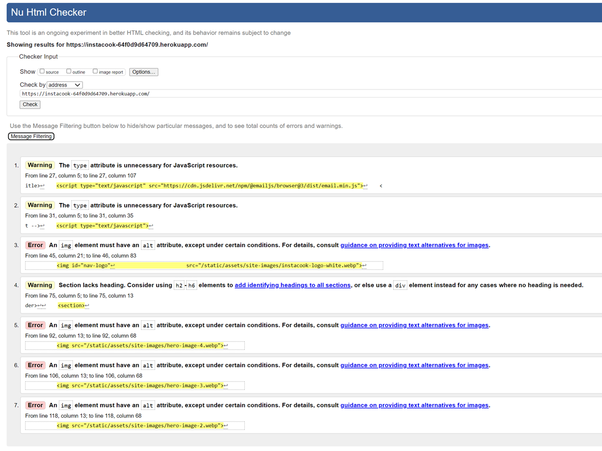
##### After updates
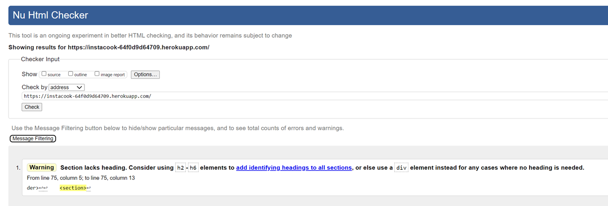

#### Login Page

The validator highlighted:
* __Warning:__ Section lacks h2-h6 heading - The design structure does not require a header for this part. It is the section that holds the flash messages, but from a semantic perspective, it is better to keep the section element rather than a div so I ignored this warning.

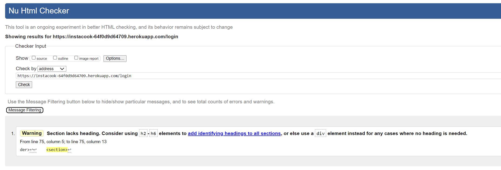

#### Register Page

The validator highlighted:
* __Warning:__ Section lacks h2-h6 heading - The design structure does not require a header for this part. It is the section that holds the flash messages, but from a semantic perspective, it is better to keep the section element rather than a div so I ignored this warning.

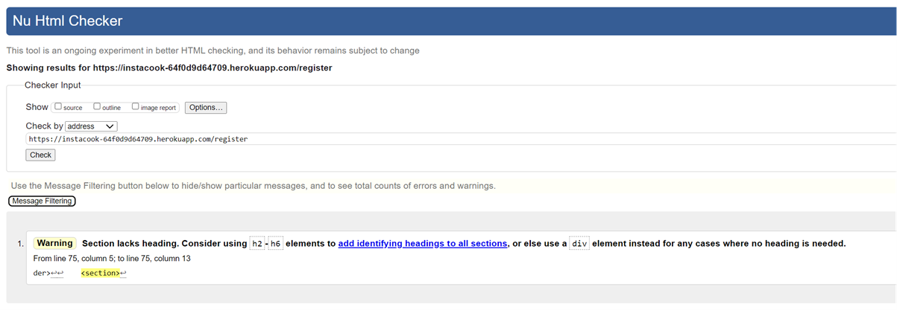

#### Contact Page

The validator highlighted:
* __Error:__"type=text" on textarea - not required.
* __Warning:__ Section lacks h2-h6 heading - The design structure does not require a header for this part. It is the section that holds the flash messages, but from a semantic perspective, it is better to keep the section element rather than a div so I ignored this warning.

##### Before
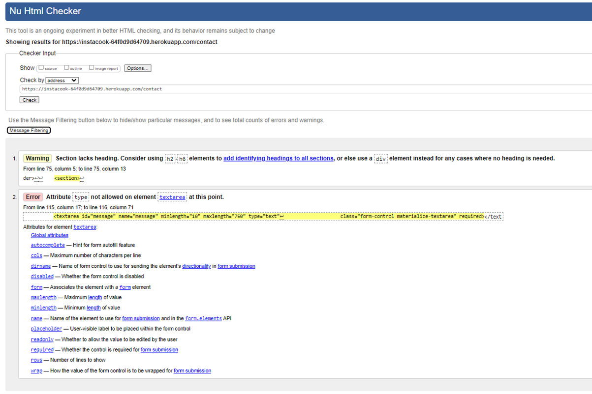
##### After updates
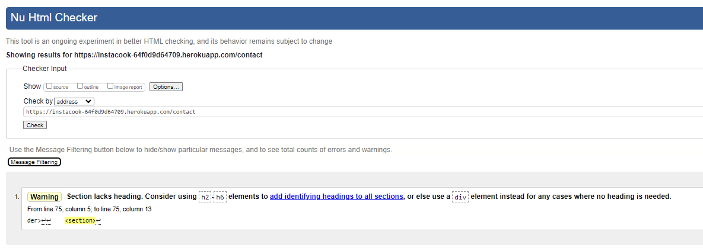

#### Dashboard Page

The validator would not work for the deployed link of this page, saying it was not retreiveable. This will be due to the fact that dashboard only loads when a session cookie is in place from a user login, so it would not be able to render in the validator. To work around this I added the raw code into the validator, and checked through for any justified errors. The validator, due to the fact the raw code has templating code in it that refers to the base.html for the header etc., was throwing alot of irrelevant errors, as you can see below. I checked each of them one by one, and none were justified errors that required changes.

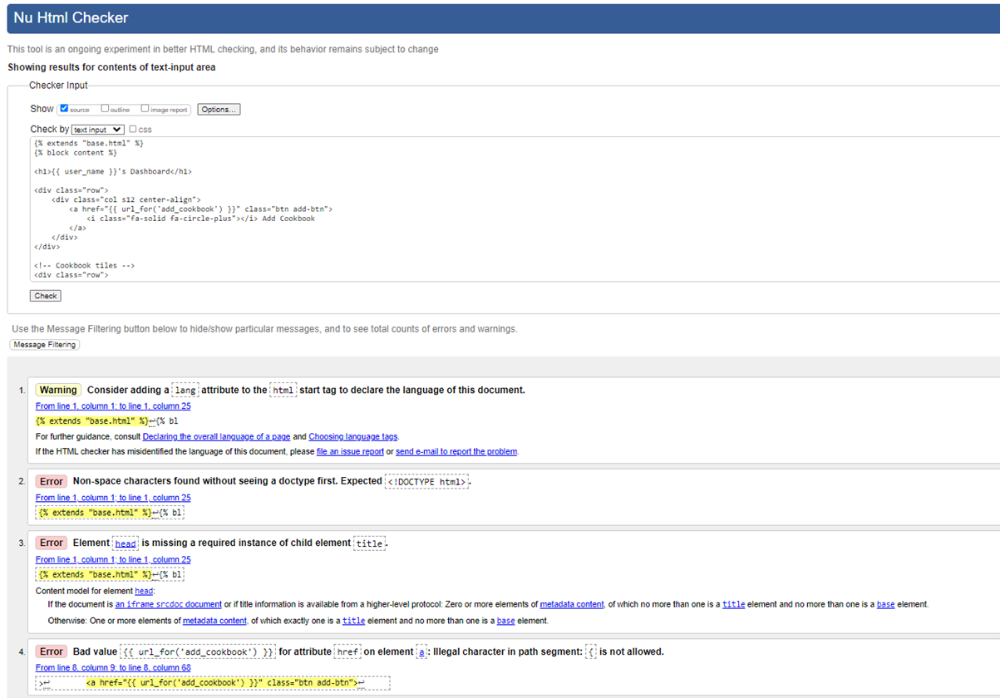

#### Add Cookbook Page

The validator highlighted:
* __Warning:__ Section lacks h2-h6 heading - The design structure does not require a header for this part. It is the section that holds the flash messages, but from a semantic perspective, it is better to keep the section element rather than a div so I ignored this warning.

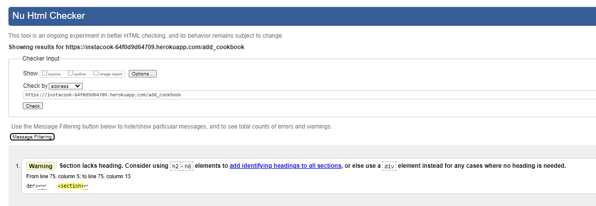

#### Edit Cookbook Page

The validator highlighted:
* __Warning:__ Section lacks h2-h6 heading - The design structure does not require a header for this part. It is the section that holds the flash messages, but from a semantic perspective, it is better to keep the section element rather than a div so I ignored this warning.

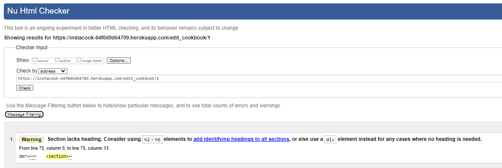

#### Recipes Page

The validator highlighted:
* __Warning:__ Section lacks h2-h6 heading - The design structure does not require a header for this part. It is the section that holds the flash messages, but from a semantic perspective, it is better to keep the section element rather than a div so I ignored this warning.

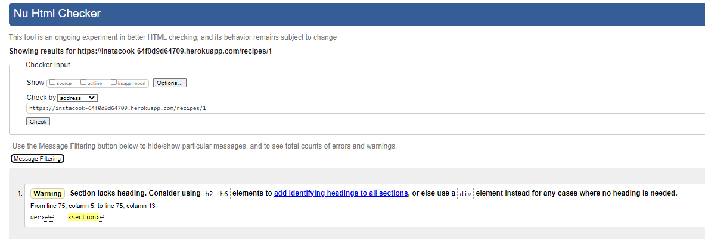

#### Search Page

The validator highlighted:
* __Error:__ Unclosed div element - closed the element and it resolved the "/li" error .
* __Error:__ Unclosed span element - removed the span element.
* __Warning:__ Section lacks h2-h6 heading - The design structure does not require a header for this part. It is the section that holds the flash messages, but from a semantic perspective, it is better to keep the section element rather than a div so I ignored this warning.

##### Before
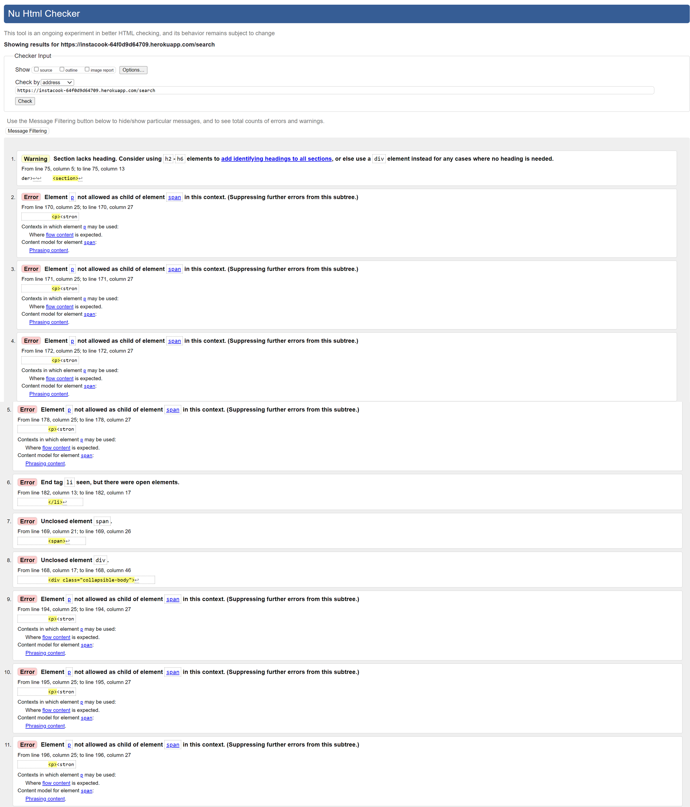
##### After updates
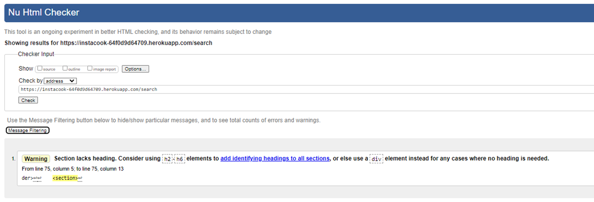

#### Add Recipe Page

The validator highlighted:
* __Error:__"type=text" on textarea - not required.
* __Warning:__ Section lacks h2-h6 heading - The design structure does not require a header for this part. It is the section that holds the flash messages, but from a semantic perspective, it is better to keep the section element rather than a div so I ignored this warning.

##### Before
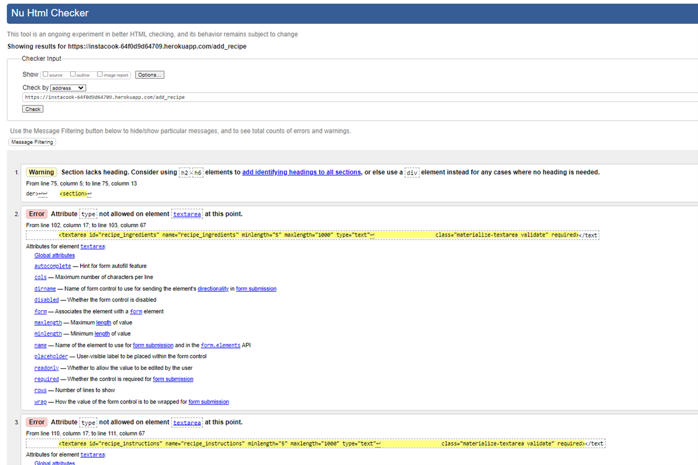
##### After updates
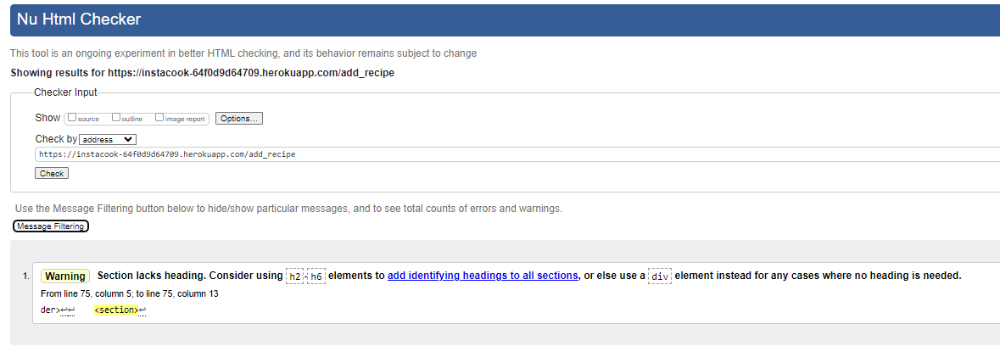

#### Edit Recipe Page

The validator highlighted:
* __Error:__"type=text" on textarea - not required.
* __Error:__ first child disabled option in dropdown, the value should be empty - emptied the values on these options.
* __Warning:__ Section lacks h2-h6 heading - The design structure does not require a header for this part. It is the section that holds the flash messages, but from a semantic perspective, it is better to keep the section element rather than a div so I ignored this warning.

##### Before
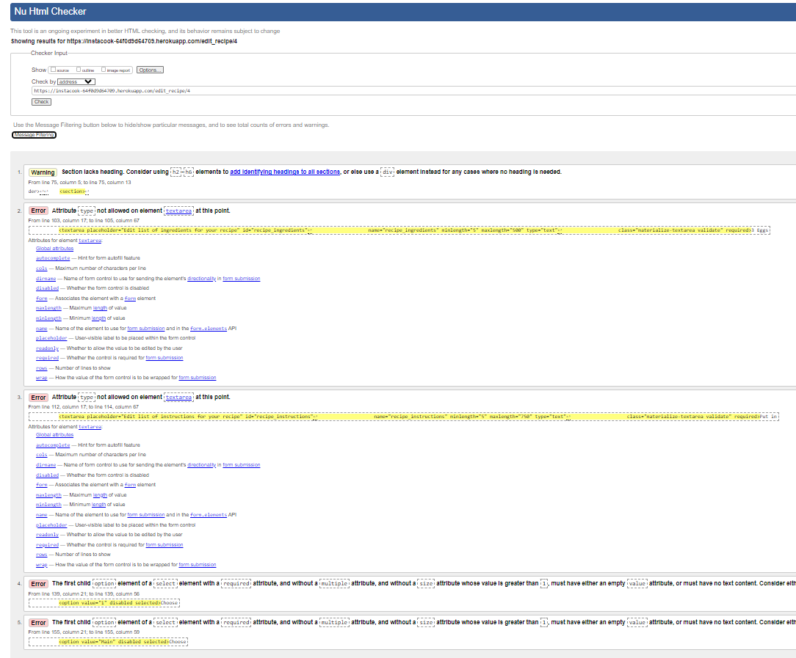
##### After updates
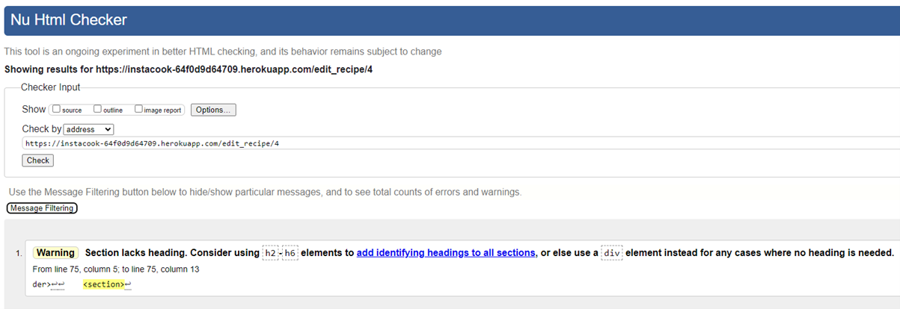

#### Thank you Page

The validator highlighted:
* __Warning:__ Section lacks h2-h6 heading - The design structure does not require a header for this part. It is the section that holds the flash messages, but from a semantic perspective, it is better to keep the section element rather than a div so I ignored this warning.

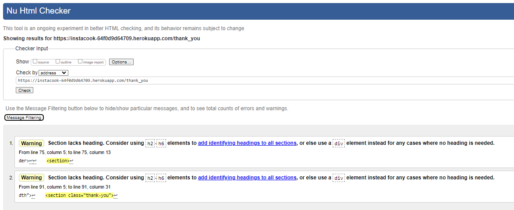

### CSS Validator - [W3C](https://jigsaw.w3.org/css-validator/)

No errors were found in my CSS code when put through the validator.
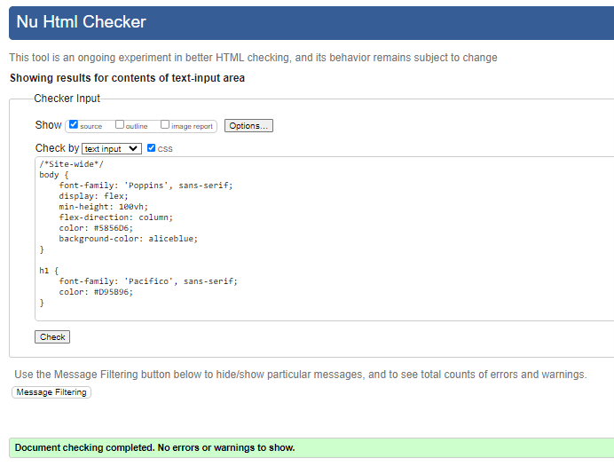

### JSHint Validator - [JSHint](https://jshint.com/)

#### Script.js
* __Warning:__ 'let' is available in ES6 - no need to change
* __Warning:__ 'M' undefined variable - This error is a side effect of using the Materialize library. I cannot change this quote without it affecting the function with the library, so have ignored this.
* __Warning:__ 'updateQueryParams' unused variable - this is used within the search page funtionality, so this warning can be ignored in this instance.

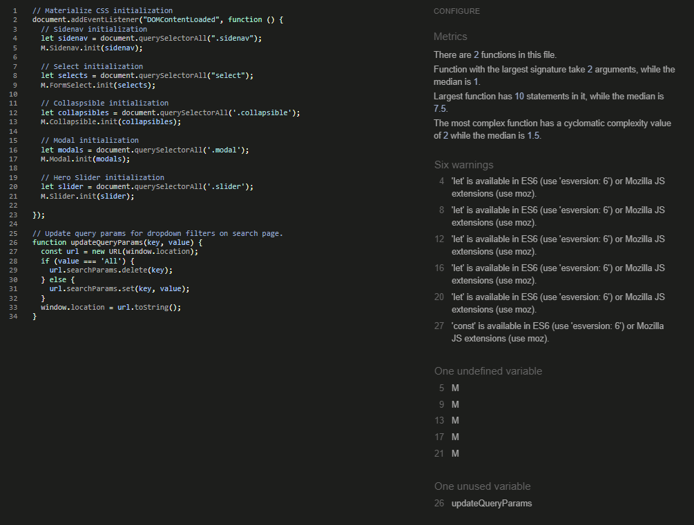

#### Send_mail.js
* __Warning:__ 'emailjs' undefined variable - this is the code snippet required to interact with the EmailJS API so I cannot change this.
* __Warning:__ 'sendMail' unused variable - The variable is called within the contact page in the HTML, so does not require changing.

### Python Validator - [Code Institute Python Linter](https://pep8ci.herokuapp.com/)

#### run.py file

The validator highlighted:
* __Error:__"no new line at end of file" - added new line at the bottom of the code which cleared the error.

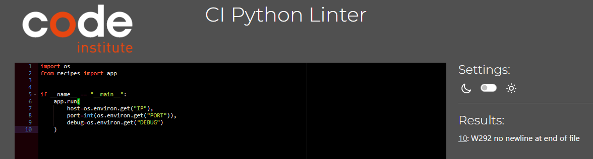

#### routes.py file

The validator highlighted:
* __Error:__"no new line at end of file" - added new line at the bottom of the code.
* __Error:__"expected 2 blank lines, found 1" - added extra line.
* __Error:__"line too long" - split the line up.
* __Error:__"over-indented" - reduced indentation.
* __Error:__"blank line contains whitespace" - removed white space.
* __Error:__"missing whitespace around operator" - added whitespace.

Cleared all the errors below.

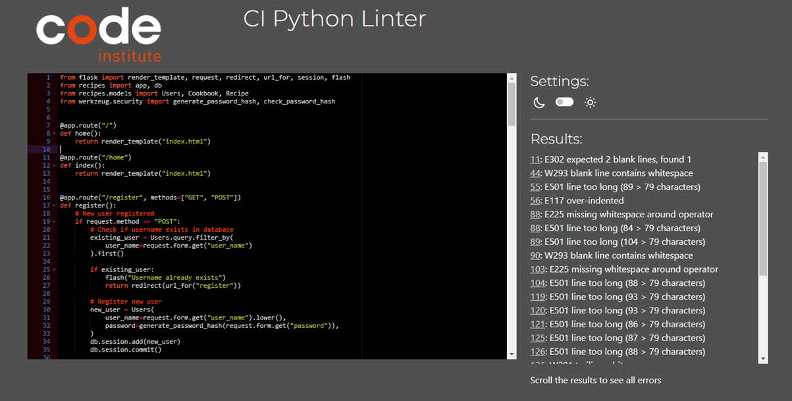

#### models.py file

The validator highlighted:
* __Error:__"no new line at end of file" - added new line at the bottom of the code.
* __Error:__"expected 2 blank lines, found 1" - added extra line.
* __Error:__"line too long" - split the line up.

Cleared all the errors below.

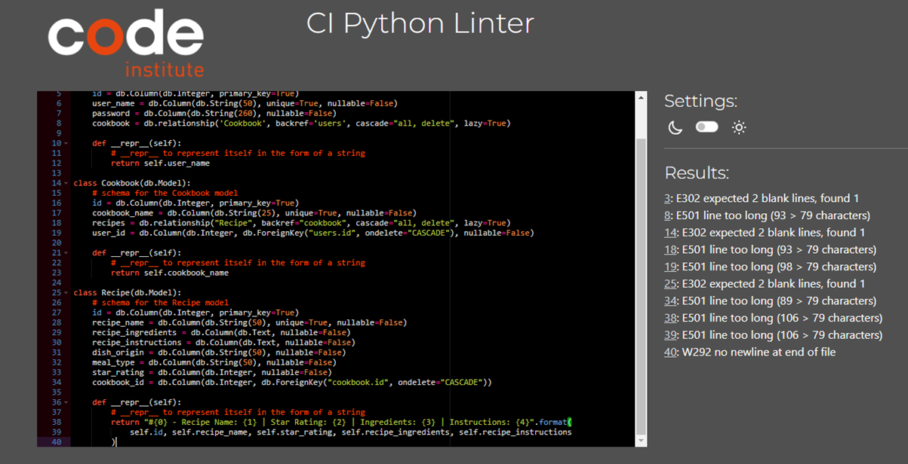

#### __init__.py file

The validator highlighted:
* __Error:__"indentation not a multiple of 4" - fixed indent.
* __Error:__"over-indented" - reduced indent.
* __Error:__"module level import not at top of file" - put line 24 at the top with other imports.

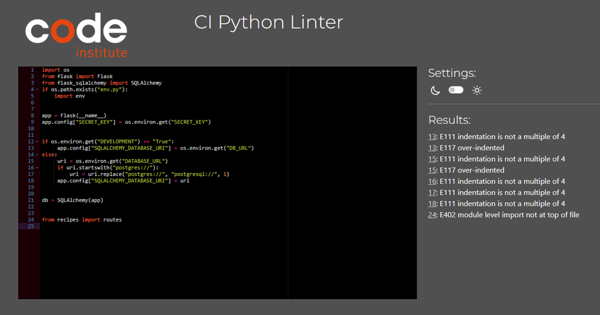

### Lighthouse

To test performance and accessibility, I used Lighthouse within the Chrome Developer Tools. 

| Page | Results |
| --- | --- |
| Home Page |  |
| Login Page |  |
| Register Page |  |
| Dashboard Page |  |
| Search Page |  |
| Contact Page |  |
| Thank You Page |  |
| Add Recipe Page |  |
| Edit Recipe Page |  |
| Add Cookbook Page |  |
| Edit Cookbook Page |  |
| Recipes Page |  |
