# Instacook Testing

[View the live project here.](https://instacook-64f0d9d64709.herokuapp.com//)

As with any project, I have been rigorously testing throughout the development process of this web application. I have documented my testing strategy that I planned before I started developing, as well as main bugs that arose whilst developing and how I approached fixing them. I have also tested my web app on different devices and asked family and friends to use and give feedback as to how to improve user experience and inform me of any bugs spotted during use.

With the scale of this project in the grand scheme of things being quite small, automated testing with softwares like Jest or Pytest, for Javascript and Python respectively. In this instance it has not been necessary, but I undestand with larger projects with more extensive functions, that this would be useful and essential. I want to use Jest and Pytest in future larger projects.

I have used a mixture of manual and automated testing while developing, both of which play a key role in forming a web application that works correctly and consistently. Automated testing can be great for doing quick overview results, for example checking code compliant with style guides etc., especially with more extensive projects and applications. Manual testing has allowed me to look at things at a deeper level, checking things like user experience design and in turn finding areas for improvement to strengthen my application as a whole. Using both has allowed me to build reliable functions and code and a higher quality end product.

## Table of Contents

1. [Automated Testing](#automated-testing)
2. [Manual Testing](#manual-testing)

## AUTOMATED TESTING

### HTML Validator - [W3C](https://validator.w3.org/)

I put every page in my site into the HTML validator. This was useful to highlight some code errors that I had missed looking through manually.

#### Home Page

The validator highlighted:
* __Error:__ Missed alt tags on images.
* __Error:__"type=text/javascript" - not required.
* __Warning:__ Section lacks h2-h6 heading - The design structure does not require a header for this part. It is the section that holds the flash messages, but from a semantic perspective, it is better to keep the section element rather than a div so I ignored this warning.

##### Before

##### After updates

#### Login Page

The validator highlighted:
* __Warning:__ Section lacks h2-h6 heading - The design structure does not require a header for this part. It is the section that holds the flash messages, but from a semantic perspective, it is better to keep the section element rather than a div so I ignored this warning.

#### Register Page

The validator highlighted:
* __Warning:__ Section lacks h2-h6 heading - The design structure does not require a header for this part. It is the section that holds the flash messages, but from a semantic perspective, it is better to keep the section element rather than a div so I ignored this warning.

#### Contact Page

The validator highlighted:
* __Error:__"type=text" on textarea - not required.
* __Warning:__ Section lacks h2-h6 heading - The design structure does not require a header for this part. It is the section that holds the flash messages, but from a semantic perspective, it is better to keep the section element rather than a div so I ignored this warning.

##### Before

##### After updates

#### Dashboard Page

The validator would not work for the deployed link of this page, saying it was not retreiveable. This will be due to the fact that dashboard only loads when a session cookie is in place from a user login, so it would not be able to render in the validator. To work around this I added the raw code into the validator, and checked through for any justified errors. The validator, due to the fact the raw code has templating code in it that refers to the base.html for the header etc., was throwing alot of irrelevant errors, as you can see below. I checked each of them one by one, and none were justified errors that required changes.

#### Add Cookbook Page

The validator highlighted:
* __Warning:__ Section lacks h2-h6 heading - The design structure does not require a header for this part. It is the section that holds the flash messages, but from a semantic perspective, it is better to keep the section element rather than a div so I ignored this warning.

#### Edit Cookbook Page

The validator highlighted:
* __Warning:__ Section lacks h2-h6 heading - The design structure does not require a header for this part. It is the section that holds the flash messages, but from a semantic perspective, it is better to keep the section element rather than a div so I ignored this warning.

#### Recipes Page

The validator highlighted:
* __Warning:__ Section lacks h2-h6 heading - The design structure does not require a header for this part. It is the section that holds the flash messages, but from a semantic perspective, it is better to keep the section element rather than a div so I ignored this warning.

#### Search Page

The validator highlighted:
* __Error:__ Unclosed div element - closed the element and it resolved the "/li" error .
* __Error:__ Unclosed span element - removed the span element.
* __Warning:__ Section lacks h2-h6 heading - The design structure does not require a header for this part. It is the section that holds the flash messages, but from a semantic perspective, it is better to keep the section element rather than a div so I ignored this warning.

##### Before

##### After updates

#### Add Recipe Page

The validator highlighted:
* __Error:__"type=text" on textarea - not required.
* __Warning:__ Section lacks h2-h6 heading - The design structure does not require a header for this part. It is the section that holds the flash messages, but from a semantic perspective, it is better to keep the section element rather than a div so I ignored this warning.

##### Before

##### After updates

#### Edit Recipe Page

The validator highlighted:
* __Error:__"type=text" on textarea - not required.
* __Error:__ first child disabled option in dropdown, the value should be empty - emptied the values on these options.
* __Warning:__ Section lacks h2-h6 heading - The design structure does not require a header for this part. It is the section that holds the flash messages, but from a semantic perspective, it is better to keep the section element rather than a div so I ignored this warning.

##### Before

##### After updates

#### Thank you Page

The validator highlighted:
* __Warning:__ Section lacks h2-h6 heading - The design structure does not require a header for this part. It is the section that holds the flash messages, but from a semantic perspective, it is better to keep the section element rather than a div so I ignored this warning.

### CSS Validator - [W3C](https://jigsaw.w3.org/css-validator/)

No errors were found in my CSS code when put through the validator.

### JSHint Validator - [JSHint](https://jshint.com/)

#### Script.js
* __Warning:__ 'let' is available in ES6 - no need to change
* __Warning:__ 'M' undefined variable - This error is a side effect of using the Materialize library. I cannot change this quote without it affecting the function with the library, so have ignored this.
* __Warning:__ 'updateQueryParams' unused variable - this is used within the search page funtionality, so this warning can be ignored in this instance.

#### Send_mail.js
* __Warning:__ 'emailjs' undefined variable - this is the code snippet required to interact with the EmailJS API so I cannot change this.
* __Warning:__ 'sendMail' unused variable - The variable is called within the contact page in the HTML, so does not require changing.

### Python Validator - [Code Institute Python Linter](https://pep8ci.herokuapp.com/)

#### run.py file

The validator highlighted:
* __Error:__"no new line at end of file" - added new line at the bottom of the code which cleared the error.

#### routes.py file

The validator highlighted:
* __Error:__"no new line at end of file" - added new line at the bottom of the code.
* __Error:__"expected 2 blank lines, found 1" - added extra line.
* __Error:__"line too long" - split the line up.
* __Error:__"over-indented" - reduced indentation.
* __Error:__"blank line contains whitespace" - removed white space.
* __Error:__"missing whitespace around operator" - added whitespace.

Cleared all the errors below.

#### models.py file

The validator highlighted:
* __Error:__"no new line at end of file" - added new line at the bottom of the code.
* __Error:__"expected 2 blank lines, found 1" - added extra line.
* __Error:__"line too long" - split the line up.

Cleared all the errors below.

#### __init__.py file

The validator highlighted:
* __Error:__"indentation not a multiple of 4" - fixed indent.
* __Error:__"over-indented" - reduced indent.
* __Error:__"module level import not at top of file" - this line has to be at the end of the file to be called after the rest.

### Lighthouse

To test performance and accessibility, I used Lighthouse within the Chrome Developer Tools. Accessibility was down by 1% on the search page, based on the contrast between the pink background and white recipe name text on top.

| Page | Results |
| --- | --- |
| Home Page | 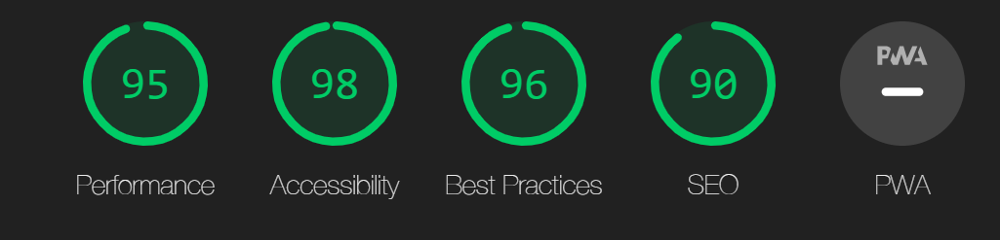 |
| Login Page | 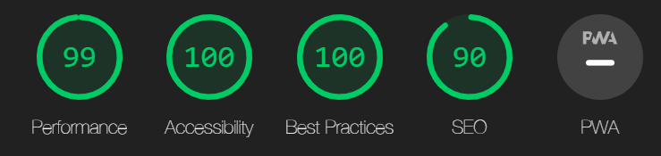 |
| Register Page | 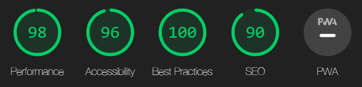 |
| Dashboard Page | 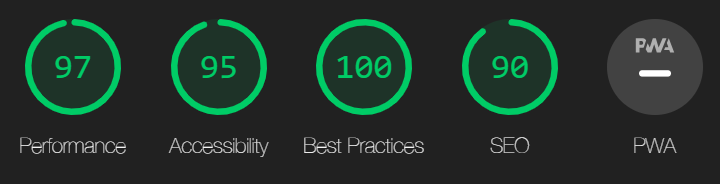 |
| Search Page | 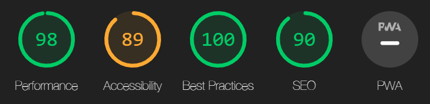 |
| Contact Page | 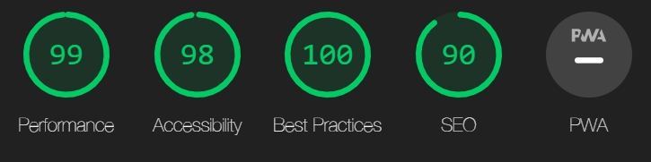 |
| Add Recipe Page | 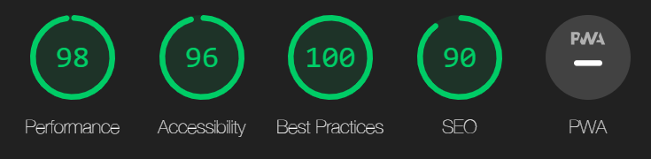 |
| Edit Recipe Page | 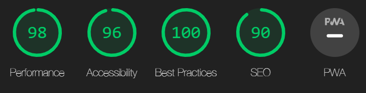 |
| Add Cookbook Page | 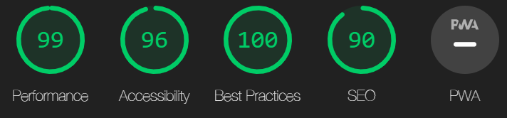 |
| Edit Cookbook Page | 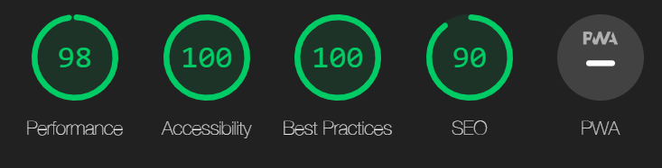 |
| Recipes Page | 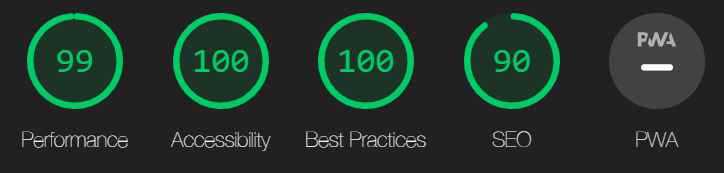 |

## MANUAL TESTING

### Testing User Stories

#### First time user

| Goals | How are they achieved? | Image |
| --- | --- | --- |
| As a first time user, I need to be able to understand the purpose of the site instantly and lead intuitively to thr first call-to-action. | This is achieved through a simple and clear synopsis on screen as the first thing the user sees. Right below to call-to-action to 'Register' is easily visible. |  |
| I want to be able to start creating digital cookbooks quickly and add recipes to them. | Once the new user has registered they are automatically redirected to their dashboard where they can create cookbooks and the create recipes within them. |  |
| I need to have simple instructions and layout so I am not overwhelmed by too much content or instructions. | This is achieved with clear calls to action buttons, like the buttons on each cookbook card on the user's dashboard clearly demonstrate what is possible as next steps. |  |
| I want to be able to get inspiration and a feel for what other recipes users have uploaded. | Whether logged in or not I can filter through and view all the recipes on the site, with 3 simple dropdown filters. A link to this page is in the nav bar on all pages. | |
| Should I have any questions or issues, I need to be able to contact the developer easily | The user can find a link to the contact form on all pages in both the nav bar and footer, so wherever the user is looking on the page, a link will always be clearly visible |  |

#### Returning/Frequent user
| Goals | How are they achieved? | Image |
| --- | --- | --- |
| As a returning user, I want to easily log in to my existing account to access my content. | The home page displays a prominent login call to action button and once a user is logged in, they are redirected to their dashboard to see their current cookbooks.|  |
| I want to be able to modify or delete existing cookbooks and recipes | From their dashboard, the user can edit their cookbook names by clicking the edit button on their chosen cookbook card. They can also delete cookbooks and all recipes within that cookbook, just by clicking the delete button on the cookbook card. They will be met with a modal pop-up asking them to confirm their action, to avoid cookbooks and recipes within them being deleted accidentally. From the recipes page view, they can edit and delete recipes using the buttons at the bottom of the recipe info. |   |

### Devices Used For Testing

I have asked friends and family to test the site on their devices. This app has been tested on the following:

Poco X3 NFC - Chrome
Iphone 10 - Firefox
Ipad Pro - Safari
Huawei Matebook Pro - Microsoft Edge and Chrome
Google Pixel - Chrome

### Full Manual Testing

#### Home Page
| Feature/Action | Expected Outcome | Testing Performed | Result | Pass/Fail |
| --- | --- | --- | --- | --- |
| Login button | User is redirected to the Login page when clicked | Clicked Login button | Redirected to the login page | Pass |
| Register button | User is redirected to the Register page when clicked | Clicked the Register button | Redirected to the register page | Pass  |

#### Login
| Feature/Action | Expected Outcome | Testing Performed | Result | Pass/Fail |
| --- | --- | --- | --- | --- |
| Login with correct credentials | User is redirected to the their dashboard with a flash message at the top of the page that says 'Welcome "Username"' | Used correct credentials in input fields | Redirected to the Dashboard and flash message appeared | Pass |
| Login with incorrect credentials | User is kept on the Login page and a flash message appears at the top of the page saying 'Incorrect Username and/or Password' | Used incorrect credentials in input fields | Flash message appeared | Pass  |
| Register link | User is redirected to the Register page when clicked | Clicked the Register button | Redirected to the register page | Pass  |

#### Register
| Feature/Action | Expected Outcome | Testing Performed | Result | Pass/Fail |
| --- | --- | --- | --- | --- |
| Register with incorrect username format | It stays on the register page and a validation message appears asking them to match the required format. | Entered a username below 5 characters, over 15 characters and with special characters. | Validation message appeared | Pass |
| Register with incorrect password format | It stays on the register page and a validation message appears asking them to match the required format. | Tried to register with a password below 5 characters, over 15 characters, only numbers, only lowercase letters, only uppercase characters, only lowercase characters and numbers, only uppercase characters and numbers, only special characters. | Validation message appeared | Pass |
| Input correct username and password. | User is redirected to their dashboard and flash message 'Registration successful'. | Registered with correct details. | Redirected to the dashboard with flash message "Registration successful".| Pass |
| Login link | Redirect to the login page. | Clicked login button | Redirected to the the login page | Pass |

#### Search
#### Contact
#### Thank you
#### Dashboard
#### Recipes
#### Edit Recipe
#### Edit Cookbook
#### Add Recipe
#### Add Cookbook
#### 404 Page

#### Log out nav bar
#### Log in nav bar

#### Footer

### Bugs

#### Solved Bugs

#### Unsolved Bugs

None known at this time.